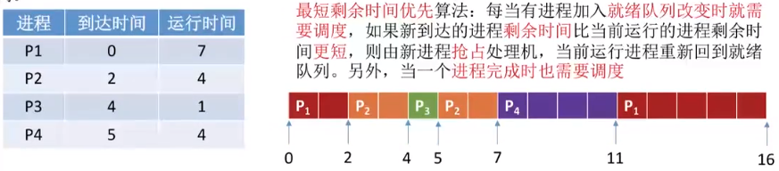
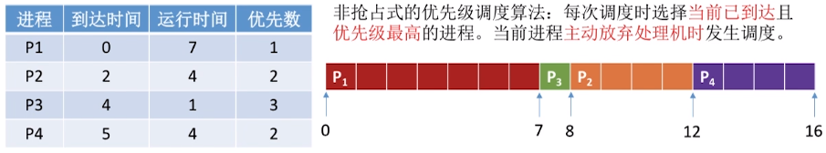
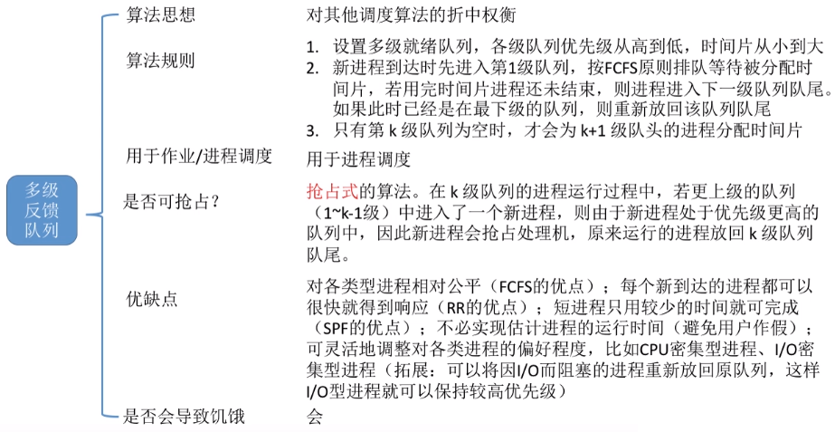
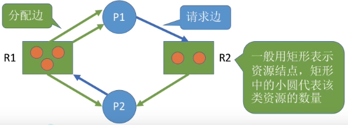
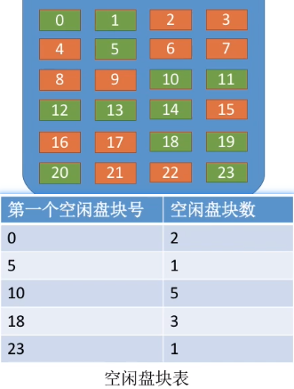
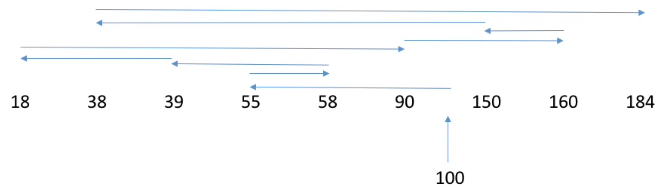
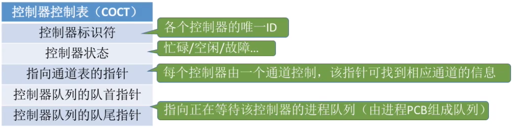

# 操作系统

## 操作系统概述

### 操作系统特征

1. **并发**：多个事件在同一时间间隔内发生，宏观上同时发生，微观上交替发生

   ​             并行：多个事件在同一时间同时发生

2. **共享**：

   1. 互斥共享：同一时间只允许一个进程访问，比如摄像头
   2. 同时共享：同一时间允许多个进程访问，比如QQ和微信同时上传一个文件（微观上交替进行访问）

3. **虚拟**

   1. 空分复用技术（如虚拟存储器技术）
   2. 时分复用技术（如虚拟处理器技术）

4. **异步**

   进程的随机性，不可预知性

> 并发和共享是两个最基本的特征，互为存在条件，没有并发和共享，就谈不上虚拟和异步

### 操作系统功能

1. 文件管理
2. 设备管理
3. 存储器管理
4. 处理机管理

### 操作系统的发展

1. 手工阶段

2. 批处理阶段

   1. 单道批处理系统

      

   2. 多道批处理系统

      

3. 分时操作系统

   计算机以时间片为单位轮流为各用户/作业服务，不能优先响应一些紧急任务

4. 实时操作系统

   1. 硬实时操作系统：必须在规定时间完成，如导弹制导
   2. 软实时操作系统：可偶尔违反规定时间，如12306刷新车票

   计算机能够优先响应一些紧急任务，不需 要时间片排队

## 操作系统的运行环境

### 操作系统的运行机制

* 两种指令
  * 特权指令：如内存清零
  * 非特权指令：如普通算术运算
* 两种程序
  * 内核程序：运行在核心态
  * 应用程序：运行在用户态
* 两种处理器状态
  * 核心态：可执行特权和非特权指令
  * 用户态：只能执行非特权指令

### 操作系统的内核

* 小内核
  * 时钟管理
  * 中断机制
  * 原语

* 大内核
  * 小内核
  * 进程管理
  * 设备管理
  * 存储器管理

### 中断

中断的本质：发生中断就意味着操作系统介入，开展管理工作。

* 内中断（异常）
* 外中断（中断）

发生中断后，CPU立即进入核心态

用户态——>核心态：通过中断实现，且是**唯一途径**

核心态——>用户态：通过特权指令实现，将程序状态字（PSW）的标志位设置为用户态

> 原语通过关中断和开中断实现

### 系统调用

系统调用：用户程序请求系统服务

* 设备管理
* 文件管理
* 进程控制
* 进程通信
* 内存管理

> 系统调用会使得计算机从用户态转到核心态
>
> 发生系统调用的请求是在用户态，对系统调用的处理是在核心态
>
> 应用程序通过执行陷入指令来发起系统调用 
>
> 陷入指令是唯一一个只能运行在用户态，不可以在核心态执行的指令

## 进程管理

### 进程

#### 特征

* 动态性
* 独立性
* 异步性
* 并发性
* 结构性

进程实体包括PCB、程序段、数据段

PCB：进程控制模块，用来存放进程的各种信息，是进程存在的唯一标志

进程的封闭性是指进程执行的结果只取决于进程本身，不受外界影响

> 进程是系统进行资源分配和调度的基本单位（未引入线程前）

#### 状态转换

#### 进程控制

进程控制主要实现进程之间的状态切换，用**原语**实现

1. 更新PCB信息（修改进程状态，将运行环境保存到PCB，从PCB恢复运行环境）
2. 将PCB插入合适的队列
3. 分配/回收系统资源

控制原语

* 进程的创建
* 进程的终止
* 进程的切换
* 进程的阻塞与唤醒（成对出现）

#### 进程通信

进程之间需要信息交换，如QQ音乐分享歌曲到微信

1. 共享存储

   需要互斥的访问共享空间

2. 消息传递

   1. 直接通信：放入消息缓冲队列
   2. 间接通信：双方通过信箱

3. 管道通信

   两个进程互斥的访问

   没写满，不能读；没读完，不能写

   写满后不能再写，读完后不能再读

   半双工通信，若需要双方互动，则需要两个管道

### 线程

引入线程后，一个QQ程序可以并发的执行传文件、开视频、发消息等

引入线程后，线程是独立调度的基本单位，进程是拥有资源的基本单位

实现方式：

* 用户级线程

  在用户态下即可完成线程切换，无需操作系统的干预

* 内核级线程

  线程的切换需要在核心态下完成

  内核级线程才是处理机分配的基本单位

在多核CPU中，多个线程可以占用不同的CPU

同一进程中，切换线程开销较小 

### 处理机调度

* 高级调度（作业调度）

  从外存选择作业进入内存并为其分配资源，建立进程

* 中级调度（内存调度）

  为提高内存利用率，将暂时不用的进程调到外存挂起，当内存空闲时再调入内存

* 低级调度（进程调度）

  选择就绪态的进程调入处理机

三者之间的联系：

信号量：系统中某种资源的数量

原语：某种程序段，只能一气呵成执行，不可被中断，原语是由开中断/关中断实现的

死锁：各进程互相等待对方手里的资源，导致各进程都阻塞，无法向前推进的现象。

饥饿：由于长期得不到想要的资源，某进程无法向前推进的现象。比如:在短进程优先(SPF) 算法中，若有源源不断

的短进程到来，则长进程将一直得不到处理机，从而发生长进程“饥饿”

#### 进程调度的时机

* 主动放弃处理机
  * 进程正常终止
  * 主动阻塞
  * 运行过程中发生异常而终止
* 被动放弃处理机
  * 时间片用完
  * 更高优先级进程进入
  * 有更紧急的事情处理（如 I/O中断）

以下时机不能进行进程调度：

* 处理中断的过程中
* 原子操作过程中（原语）
* 进程处于操作系统内核程序临界区中

#### 进程调度的方式

* 剥夺式（抢占式）

  有更高优先级的进程需要处理机时，操作系统可以剥夺当前进程的使用权

* 非剥夺式（非抢占式）

  只能由当前运行的进程主动放弃处理机

#### 调度的评价指标

* CPU利用率

* 系统吞吐量

  单位时间CPU完成作业的数量

* 周转时间

  从作业提交到作业完成的时间

* 等待时间

  进程处于等待处理机的时间之和

* 响应时间

#### 调度算法

##### 先来先服务调度（FCFS）

> 只考虑了等待时间，对短作业不友好

##### 短作业优先调度（SJF）

> 只考虑了运行时间，对长作业不友好

* 非抢占式

  

* 抢占式

  

##### 高响应比优先调度（HRRN）

##### 时间片轮转调度（RR）

时间片大小为 2 时：

时间片大小为 5 时：

> 时间片过小会导致进程切换频繁，开销比较大
>
> 时间片过大，如果使得每个进程都在时间片完成的话，会退化成为先来先服务调度算法

##### 优先级调度

优先级

* 静态优先级：创建进程时确定，之后一直不变

* 动态优先级：创建进程时给定初始值，随后动态调整

  > 高响应比优先调度算法也是一种特殊的优先级调度

* 抢占式

  

* 非抢占式

  

  

##### 多级反馈队列调度

> 源源不断地短作业到来时，低优先级的作业就会饥饿

多级反馈调度示例：

> 先来先服务、短作业优先、高响应比优先应用于早期的批处理系统，用户体验较差
>
> 时间片轮转、优先级调度、多级反馈队列调度适用于交互式系统

### 进程互斥与进程同步

临界资源：一次只允许一个进程访问的资源

进程同步：让进程之间相互配合，比如先写入数据，再读取数据

进程互斥：各个并发的进程对临界资源的访问，需要互斥的进行

进程互斥需要遵循的原则：

1. 空闲让进。临界区空闲时，应允许一个请求临界资源的进程进入
2. 忙则等待。临界区被占用时，其他请求的进程必须等待
3. 有限等待。要在有限的时间里让等待的进程进入临界区，防止饥饿
4. 让权等待。进入不了临界区的进程，应立即释放处理机，防止进程忙等待

临界资源的访问过程：

1. 进入区：检查是否可以进入临界区，如果可以，负责“上锁”
2. 临界区：访问临界资源的代码
3. 退出区：负责“解锁”
4. 剩余区：代码中的其余部分

P/V操作：是实现进程互斥和进程同步的方法，P表示给临界区上锁，信号量减1，B表示释放临界区，信号量加1

管程：类似于程序语言中的类，封装好了PV操作，只需要调用即可

> 同一时间内只能由一个进程访问的资源成为临界资源，如打印机，摄像头

进程互斥的软件实现方法：

1. 单标志法

   

   缺点：会出现违背“空闲让进”

2. 双标志法先检查

   

   缺点：会出现违背“忙则等待”

3. 双标志法后检查

   

   缺点：会出现“饥饿”

4. 皮特森算法

   

进程互斥的硬件实现方法：

1. 中断屏蔽：只适用于单处理机
2. TestAndSet指令
3. Swap指令

### 信号量

信号量其实就是一个变量，代表系统中某种资源的数量

使用wait(S)，signal(S)访问，也叫做P、V操作（P：资源数减一，V：资源数加一）

* 整型信号量

  并未实现“让权等待”

  

* 记录型信号量

  可以实现“让权等待”，block语句实现自我阻塞，防止忙等

  

#### 利用信号量实现同步

1. 分析问题，找出一前一后的关系
2. 设置初始信号量为0
3. 在前一个操作之后执行V操作
4. 在后一个操作之前执行P操作

#### 利用信号量实现互斥

1. 将临界区看成特殊的信号量，初始值设为1
2. 在临界区之前进行P操作
3. 在临界区之后执行V操作

#### 利用信号量实现前驱关系

每一对前驱关系都可以看做是一次实现同步的问题

### 经典同步问题

#### 生产者与消费者问题

> **实现互斥的P操作一定要在实现同步的P操作之后**

#### 多生产者与多消费者问题

#### 吸烟者问题

#### 读者与写者问题

#### 哲学家进餐问题

### 死锁

死锁：各进程互相等待对方的资源，导致各个进程都阻塞，无法向前推进

死锁产生的必要条件：

1. 互斥：对互斥的资源的争抢才会导致死锁
2. 不剥夺：进程保持的资源只能主动释放，不可强行剥夺
3. 请求和保持：保持资源不放的同时，请求别的资源
4. 循环等待：存在资源的循环等待链

> 循环等待未必死锁，死锁必定循环等待

#### 预防死锁——静态策略

#### 避免死锁——动态策略

**安全序列**：指如果系统按照这种序列分配资源，则每个进程都能顺利完成。只要能找出一个安全序列，系统就是安全状态。当然，安全序列可能有多个。如果分配了资源之后，系统中找不出任何一一个安全序列，系统就进入了不安全状态。

> 系统处于不安全状态未必死锁，但死锁时一定 处于不安全状态。系统处于安全状态一定不会死锁。

##### 银行家算法

核心思想：在进程提出资源申请时，先预判此次分配是否会导致系统进入不安全状态。如果会进入不安全状态，就暂时不答应这次请求，让该进程先阻塞等待。

以此类推，可以找到其中的一个安全序列{P1,P3,P0,P2,P4}，只要找到一个安全序列，系统就不会死锁。

#### 死锁的检测

1. 在资源分配图中，找出既不阻塞又不是孤点的进程Pi （即找出有有向边与它相连，且该有向边对应资源的

   申请数量小于等于系统中已有空闲资源数量。如下图中，R1没有空闲资源，R2有一个空闲资源。若所有的连

   接该进程的边均满足上述条件，则这个进程能继续运行直至完成，然后释放它所占有的所有资源）。消去它

   所有的请求边和分配变，使之称为孤立的结点。在下图中，P1是满足这一条件的进程结点，于是将P1的所有

   边消去。

2. 进程Pi所释放的资源，可以唤醒某些因等待这些资源而阻塞的进程，原来的阻塞进程可能变为非阻塞进程。

   在下图中，P1释放所有资源后，P2 就满足这样的条件。根据 1 中的方法进行一系列简化后，若能消去途中

   所有的边，则称该图是可完全简化的。

如果能完全消除所有的边，则说明没有发生死锁，最终还连着边的进程就是死锁进程

死锁检测类似于银行家算法，找出一个安全序列即可。

> **死锁定理：如果某时刻系统的资源分配图是不可完全简化的，那么此时系统死锁**

#### 死锁的解除

其中考虑进程已经使用了多少资源的时候，要剥夺占有资源数目多的进程，这样能释放大量资源

## 内存管理

### 内存管理概念

地址重定位：将逻辑地址转换成物 理地址

#### 程序装入

1. 编译：由编译程序将用户的源代码编译成若干目标模块
2. 链接：由链接程序将编译后的目标模块及所需的库函数链接在一起，形成装入模块
3. 装入：由装入程序将 模块装入内存运行

#### 内存的装入方式

1. 绝对装入

   编译时直接产生绝对地址，只适用于单道批处理系统

2. 可重定位装入（静态重定位）

   装入时将逻辑地址转换成物理地址

   一次性分配内存空间，一次性装入，一旦进入内存就不能移动位置

3. 动态运行时装入（动态重定位）

   运行时将逻辑地址转换成物理地址，需设置重定位寄存器

   通过改变重定位寄存器的起始地址，可以动态改变存储空间的物理地址

#### 内存管理的功能

1. 内存空间的分配与回收
2. 地址转换：将逻辑地址转换成物理地址
3. 内存空间的扩充：从逻辑上扩充内存
4. 存储保护。保证各道作业在各自的空间内运行，互不干扰

#### 内存的保护

1. 设置上、下限寄存器，用于判断物理地址是否越界
2. 设置重定位寄存器和界地址寄存器，界地址寄存器用于储存逻辑地址的最大值，重定位寄存器用于储存物理地址当中的最小值，先用界地址寄存器来比较是否越界，再用重定位寄存器来计算物理地址

#### 内存的扩充

1. 覆盖技术：常用的程序段常驻内存（固定区，不再调出），不常用的在需要时调入内存并覆盖原来的

   当按照A-B-D-C-E-F顺序依次执行时，可以使用覆盖技术，适用于早期系统，现已淘汰

   

2. 交换技术：将内存中的某些不重要进程换出外存，把重要进程换进内存，可看作“内存调度”

   文件区用于存放文件，对换区用于保存对换的进程数据，对换区的I/O速度比文件区快，PCB会常驻内存

   

3. 虚拟存储技术

#### 内存空间的连续分配

连续分配：为用户进程分配的是一个连续的内存空间

> 内部碎片：分配给某进程的内存区域有些用不上而出现剩余
>
> 外部碎片：内存中的空闲空间都太小而被进程无法利用

常用的数据结构：空闲分区表和空闲分区链

##### 单一连续分配

只支持单道程序运行，内存中永远只有一道程序

**有内部碎片，无外部碎片**

##### 固定分区分配

将用户内存空间划分为若干固定大小的分区，每个分区只装入一道作业

**有内部碎片，无外部碎片**

* 分区大小相等
* 分区大小不等

##### 动态分区分配

不预先划分分区，根据进程的大小动态的建立分区，使得分区的大小正好适合进程的需要。

**无内部碎片，有外部碎片**

###### 动态分区分配算法

#### 内存空间的非连续分配

非连续分配：为用户分配的是一个不连续的内存空间

##### 基本分页存储管理方式

把内存空间划分为大小相等且固定的块，使得内部碎片尽可能小

页：进程中的块

页框（页帧）：内存中的块

页表：记录页面在内存中对应的页框号，每一组页号和页框号称为一个页表项

页表长度：页表中总共有几个页表项，即总共有几个页

页表项长度：每个页表项占多大的存储空间

页面大小：一个页面占多大的存储空间）

页号 = 逻辑地址 / 页面长度（取整）

页内偏移量 = 逻辑地址 % 页面长度（取余）

如果用二进制表示：

> **如果每个页面大小为 2k B，用二进制数表示逻辑地址，则末尾 K 位即为页内偏移量，其余部分就是页号**

**快表**（相联存储器，TLB）：用来存放当前访问的若干页表项，是部分慢表的副本，可以加速地址变换过程

**两级页表**

两级页表可以避免占用较长的连续的内存空间来储存页表

> 若采用多级页表机制，则各级页表的大小不能超过一个页面

##### 基本分段存储管理方式

按照用户进程中的自然段划分逻辑空间，每段从0开始编号，段内要求连续，段间不要求连续。

##### 分段存储与分页存储的区别

分段比分页更能实现信息的共享和保护

分段有两次越界判断，分页有一次越界判断

分页管理不会产生外部碎片，会产生少量的内部碎片；分段管理会产生外部碎片

##### 段页式管理存储方式

先分成若干逻辑段，然后将每个段分成若干大小固定的页。

在一个进程中，只有一个段表，可以有多个页表

进行一次访问需要访问三次主存

### 虚拟内存管理

**传统存储管理方式的特征**

1. 一次性。作业必须一次性全部装入内存后才能开始运行
2. 驻留性。作业被装入内存后，就一直驻留在内存中，任何部分都不会被换出，直至作业结束

> 虚拟内存的实现是基于离散存储
>
> 虚拟内存的最大容量是由计算机的地址结构决定的，实际容量是地址结构与内外存容量之和的交集

**局部性原理**

时间局部性：如果执行了程序中的某条指令，那么不久后这条指令很有可能再次执行;如果某个数据被访问过，不

久之后该数据很可能再次被访问。（因为程序中存在大量的循环）

空间局部性：一旦程序访问了某个存储单元，在不久之后，其附近的存储单元也很有可能被访问。（因为很多数据

在内存中都是连续存放的）

**虚拟存储器特征**

1. 多次性：允许作业被分成多次调入内存
2. 对换性：允许作业换入换出
3. 虚拟性：逻辑上扩充内存

**虚拟技术的实现**

1. 请求分页存储管理
2. 请求分段存储管理
3. 请求段页存储管理

#### 请求分页存储管理

相较于基本分页存储管理，增加了请求调页和页面置换功能

当要访问的页面不存在时，就会产生一个缺页中断，如果内存中有空闲块，则为进程分配一个空闲块，将所需页面装入该块，并修改相关表项；当内存中没有空闲块时，就需要页面置换算法选择一个页面进行淘汰，若该页面在内存期间被修改过，则将其写回外存，未修改过的页面不用写回外存

#### 页面置换算法

1. 最佳置换算法（OPT）

   每次选择淘汰的页面是以后用不使用，或者在最长时间内不再访问的页面

   这需要预判，无法实现

2. 先进先出页面置换算法（FIFO）

   每次淘汰的页面是最早进入内存的页面

   > 只有FIFO算法会出现Belady异常（为进程分配的物理块数增加时，缺页次数不减反增）

3. 最近最久未使用置换算法（LRU）

   每次淘汰的页面是最近最久未使用的页面

   > LRU是根据各页以前的情况，“向前看”；OPT是根据各页以后的使用情况，“向后看”

4. 时钟置换算法（CLOCK）

   为每个页面设置一个访问位，再将内存中的页面都通过链接指针链接成一个循环队列。当某页被访问时，其

   访问位置为1。当需要淘汰一个页面时，只需检查页的访问位。如果是0，就选择该页换出；如果是1，则将它

   置为0，暂不换出，继续检查下一个页面，若第一轮扫描中所有页面都是1，则将这些页面的访问位依次置为0

   后，再进行第二轮扫描（第二轮扫描中一定会有访问位为0的页面）

   > 简单的CLOCK算法选择一个淘汰页面最多会经过两轮扫描

5. 改进型的时钟置换算法

   在考虑页面是否被访问过的同时，考虑页面是否被修改过（被修改过的页面需要被写入外存，增加开销）

   0：未被访问过；1：被访问过

   0：未被修改过；1：被修改过

   置换优先级：（访问位，修改位）

   （0，0）（0，1）（1，0）（1，1）

   > 改进型的CLOCK算法选择一个淘汰页面最多会经过四轮扫描

#### 页面分配策略

驻留集：指请求分页存储管理中给进程分配的物理块的集合。

工作集：指在某段时间间隔里，进程实际访问页面的集合。

抖动（颠簸）：刚刚换出的页面马上又被换入内存，刚刚换入内存的页面马上又被换出内存，频繁的调度行为

抖动原因：频繁调度的页面的数量大于分配的物理块

驻留集分配策略：

1. 固定分配局部置换

   系统为每个进程分配一定数量的物理块，在整个运行期间都不改变。若进程在运行中发生缺页，则只能从该

   进程在内存中的页面中选出一页换出，然后再调入需要的页面

2. 可变分配局部置换

   刚开始会为每个进程分配一定数量的物理块。当某进程发生缺页时，只允许从该进程自己的物理块中选出一

   个进行换出外存。如果进程在运行中频繁地缺页，系统会为该进程多分配几个物理块，直至该进程缺页率趋

   势适当程度；反之，如果进程在运行中缺页率特别低，则可适当减少分配给该进程的物理块。

3. 可变分配全局置换

   刚开始会为每个进程分配一定数量的物理块。操作系统会保持一个空闲物理块队列。当某进程发生缺页时，

   从空闲物理块中取出一块分配给该进程；若己无空闲物理块，则可选择一个未锁定的页面换出外存，再将该

   物理块分配给缺页的进程

可变分配全局置换只会增加物理块，可变分配局部置换可以动态增加或者减少物理块数量

## 文件管理

文件的属性

1. 名称
2. 标识符：文件的唯一标签
3. 类型
4. 位置
5. 大小
6. 保护
7. 时间、日期、用户标识

### 文件的逻辑结构

* 无结构文件：字符流

* 有结构文件

  * 顺序文件

    可以顺序存储或链式存储，记录可以是定长的也可以是可变长的

    链式存储无法实现随机存取，可变长记录的顺序存储可无法实现随机存取，定长记录的顺序存储可以实现随机存取

  * 索引文件

    建立一张索引表以加快文件检索速度。每条记录对应一个索引项

  * 索引顺序文件

    

### 文件的目录结构

> 一个文件对应一个FCB，一个FCB就是一个目录项，多个FCB组成文件目录
>

* 单级目录结构：文件不允许重名
* 两级目录结构
* 多级目录结构
* 无环图目录结构：便于文件共享

### 文件的物理结构

* 连续分配

  

  > 每个文件在磁盘上占有一组连续的块，支持随机访问和顺序访问，不方便拓展文件，会产生磁盘碎片

* 链接分配

  * 隐式链接

    

    > 只支持顺序访问

  * 显式链接

    

    > 一个磁盘只需要一个FAT（文件分配表），支持随机访问

* 索引分配

  

  > FAT是一个磁盘对应一张，索引表是一个文件对应一张，索引分配支持随机访问

  > 支持多级索引和混合索引，各层索引表大小不能超过一个磁盘块

操作系统以“块”为单位为文件分配存储空间，因此即使一个文件大小只有10B，

但它依然需要占用1KB的磁盘块。外存中的数据读入内存时同样以块为单位

### 文件的存储空间管理

文件的存储空间管理主要是对空闲块的管理

* 空闲表法

  

* 空闲链表法

  * 空闲盘块链
  * 空闲盘区链

  

* 位示图法

  

* 成组链接法

  

### 文件共享

* 硬链接（基于索引节点）

  

* 软链接（基于符号链）

  采用LINK类型的文件，记录共享文件的路径，类似于快捷方式

### 文件保护

* 口令保护

* 密码保护，如异或加密

* 访问控制

  

### 文件系统的层次结构

## 磁盘管理

磁盘的物理地址（柱面号，盘面号，扇区号）

### 磁盘调度算法

寻道时间：移动磁头时间 + 启动磁臂时间

延迟时间：磁头定位到某一磁道的扇区所用的时间

传输时间：磁盘读写数据所需的时间

#### 先来先服务算法（FCFS）

根据进程请求访问磁盘的先后顺序进行调度

#### 最短寻找时间优先算法（SSTF）

选择与当前磁头所在磁道距离最近的磁道，使得每次寻找的时间最短

**会产生饥饿**

#### 扫描算法/电梯调度算法（SCAN）

在当前移动方向上选择与当前磁头所在磁道最近的请求

不会产生饥饿现象，只有到了最边上的磁道才会改变方向

#### 循环扫面算法（C-SCAN）

在扫面算法的基础上规定磁头单方向移动，回返时直接快速移动至起始端而不服务任何请求

#### LOOK调度算法

在磁头应用方向上如果没有别的请求，不必移动到末尾的磁道即可返回

#### C-LOOK调度算法

### 减少延迟时间

> 盘内交叉，盘间错位

## I/O管理

### I/O控制器

### I/O控制方式

### I/O软件层次结构

### SPOOLing（假脱机）技术

### 设备分配

#### 设备分配的数据结构

### 缓冲区

* 单缓冲

* 双缓冲

* 缓冲池

  

* 循环缓冲区

  

> 当缓冲区数据非空时，不能往缓冲区冲入数据，只能从缓冲区把数据传出；当缓冲区为空时，可以往缓冲区
>
> 冲入数据，但必须把缓冲区充满以后，才能从缓冲区把数据传出。