# 数据结构

## 绪论

### 基本概念

**数据元素**：数据元素是数据的基本单位，通常作为-一个整体进行考虑和处理。

**数据项**：一个数据元素可由若干数据项组成,数据项是构成数据元素的不可分割的最小单位。

**数据结构**：数据结构是相互之间存在一种或多种特定关系的数据元素的集合。

**数据对象**：数据对象是具有相同性质的数据元素的集合，是数据的一个子集。

### 数据结构的三要素

* **逻辑结构**
  
  * 集合
  * 线性结构
  * 树形结构（一对多）
  * 图状结构（网状结构）（多对多）
  
* **物理结构（存储结构）**

  * 顺序存储（顺序）
  * 链式存储（指针）
  * 索引存储（索引表）
  * 散列存储

  若采用顺序存储，则各个数据元素在物理上必须是连续的；

  若采用非顺序存储（后三种），则各个数据元素在物理上可以是离散的。

* **数据的运算**

### **算法的特性**：

1. 有穷性：有穷时间内能执行完
   1. 有穷时间内能执行完
   2. 有穷时间内能执行完
2. 确定性：相同输入只会产生相同输出
3. 可行性：可行性
4. 输入：丢给算法处理的数据
5. 输出：算法处理的结果

### 算法的要求：

1. 正确性
2. 可读性
3. 健壮性
4. 效率与低存储量要求

### 算法效率的度量：

1. **时间复杂度T(n)**：时间开销与问题规模 n 之间的关系

   多项相加只保留最高项，多项相乘都保留

   只考虑最高阶部分，用大O记法表示

   顺序执行的代码只会影响常数项，可以忽略，只考虑循环里的代码

   只需挑循环里的一个基本操作分析它的执行次数与 n 的关系即可

   如果有多层嵌套循环，只需关注最深层的循环次数

   评价指标：

   最坏时间复杂度：最坏情况下的算法的时间复杂度

   平均时间复杂度：所有输入示例等概率出现的情况下，算法的期望运行时间

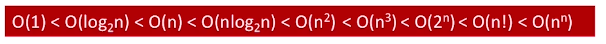

​			**常对幂指阶**

2. **空间复杂度S(n)：**

   空间复杂度=递归调用的深度

   程序代码所占用的内存空间是固定的，与问题规模无关，与变量、参数、数组当有关。

## 线性表

**线性表是具有相同数据类型的n (n≥0) 个数据元素的有限序列**

L=（a1，a2，a3，a4，......，ai，......，an）

ai是"第 i 个"元素的位序，从1开始

除第一个元素外，每个元素有且仅有一个直接前驱

除最后一个元素外，每个元素有且仅有一个直接后继

### 顺序表

-------

顺序表：线性表的顺序存储，其逻辑顺序与物理顺序相同

* 静态分配
  * 大小一旦确定就无法改变
* 动态分配
  * malloc函数
  * 时间复杂度高

**特点**：

* 随机访问
* 存储密度高
* 拓展容量不方便
* 插入、删除数据不方便

**基本操作**：

* 插入操作：平均时间复杂度为O(n)

* 删除操作：平均时间复杂度为O(n)

* 按值查找：平均时间复杂度为O(n)
  * 从前往后依次检索遍历

* 按位查找：平均时间复杂度为O(1)
  * 直接获取第 i 个元素的值

### 单链表

------------------

单链表：线性表的链式存储，每个结点都包含数据及指向其后继的指针。

头节点通常不存储数据

* 判断空表
  * 不带头结点：L == NULL
  * 带头节点：L - >next == NULL

特点：

* 不可随机存取
* 插入、删除数据方便

#### 单链表的建立：

* 头插法：时间复杂度：O(n)
* 尾插法：时间复杂度：O(n)
  * 需建立一个尾指针

#### 数据的查找：

* 按位查找：时间复杂度：O(n)
  * 只能从头到尾依次遍历
* 按值查找：时间复杂度：O(n)
  * 只能从头到尾依次遍历

#### 数据的插入：

先改变后驱指针，再改变前驱指针

时间复杂度：O(n)，时间浪费在查找结点上。

* 前插操作
  * 可以转换成后插操作
* 后插操作

#### 数据的删除

时间复杂度：O(n)，时间浪费在查找结点上。

### 双链表

--------

每个结点都有一个前驱指针、数据、后驱指针

插入、删除操作的时间复杂度为O(1)

由于不可随机存取，只能依次遍历，按位查找及按值查找的时间复杂度为O(n)

### 循环链表

---------

#### 循环单链表

判断是否空表： L -> next == L

经常在表头或者表尾操作数据的时候，可以设置尾指针，从而从表尾到表头只需要O(1)

#### 循环双链表

判断是否空表： L -> next == L

#### 静态链表

预先分配一整块空间，利用数组实现的链表，这里的指针是结点的数组下标（游标）

游标为-1表示到达表尾。

## 栈和队列

### 栈

-------

栈：只允许在一端插入或删除的线性表

特点：后进先出（LIFO）

#### 顺序栈

顺序栈：采用顺序存储的栈，附设一个栈顶指针top

​					注意top=0还是top=-1

共享栈：两个顺序栈共享一个空间

#### 链栈

链栈：采用链式存储的栈

通常采用单链表，规定所有操作（入栈(插入)、出栈(删除)）都是在表头进行。

#### 栈的应用：

1. 括号匹配

   1. 依次扫描所有字符，遇到左括号入栈，遇到右括号则弹出栈顶元素检查是否匹配。

2. 递归函数

   可能会导致栈溢出，因为每次递归都会占用栈的一部分空间

3. 表达式求值

后缀表达式：a+b-c ——> ab+c-

前缀表达式：a+b-c ——> -+abc

操作数出现的顺序不变

#### 中缀表达式转后缀表达式(手算)

1. 确定中缀表达式中各个运算符的运算顺序

2. 选择下一个运算符，按照「 左操作数右操作数运算符」的方式组合成一个新的操作数

3. 如果还有运算符没被处理，就继续②

> “左优先”原则:只要左边的运算符能先计算，就优先算左边的

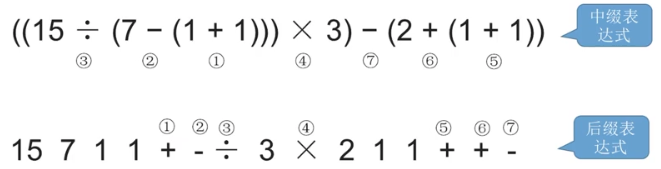

#### 中缀表达式转后缀表达式(用栈实现)

初始化一个栈，用于保存暂时还不能确定运算顺序的运算符。从左到右处理各个元素，直到末尾。

可能遇到三种情况: 

1. 遇到操作数。直接加入后缀表达式。

2. 遇到界限符。遇到 "(" 直接入栈，遇到 ")"  则依次弹出栈内运算符并加入后缀表达式，直到弹出 "(" 为止。注意 "(" 不加入后缀表达式。

3. 遇到运算符。依次弹出栈中优先级高于或等于当前运算符的所有运算符，并加入后缀表达式，若碰到 "(" 或栈空则停止。之后再把当前运算符入栈。

按上述方法处理完所有字符后，将栈中剩余运算符依次弹出，并加入后缀表达式。

#### 中缀表达式的计算(用栈实现)

其实就是中缀转后缀，然后计算后缀表达式

1. 初始化两个栈，操作数栈和运算符栈

2. 若扫描到操作数，压入操作数栈

3. 若扫描到运算符或界限符，则按照“中缀转后缀”相同的逻辑压入运算符栈（期间也会弹出运算符，每当弹出

   一个运算符时，就需要再弹出两个操作数栈的栈项元素并执行相应运算，运算结果再压回操作数栈）

#### 后缀表达式的计算(用栈实现)

1. 从左往右扫描下一个元素，直到处理完所有元素

2. 若扫描到操作数则压入栈，并回到 1；否则执行 3
3. 若扫描到运算符，则弹出两个栈顶元素，执行相应运算，运算结果压回栈顶，回到 1

> 注意：先出栈的是“右操作数”（前缀表达式相反）

#### 后缀表达式的计算(手算)

从左往右扫描，每遇到一个运算符，就让运算符前面最近的两个操作数执行对应运算，合体为一个操作数

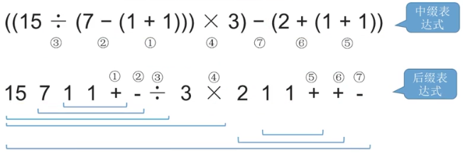

### 队列

-----------

队列：只允许在一端插入、另一端删除的线性表。

特点：**先进先出（FIFO）**

队列的顺序存储：

循环队列：用取余将静态数组的存储空间在逻辑上变为“环状”

队列的链式存储：

链队列：用单链表存储并带有头指针和尾指针

一般在链头出队，在链尾入队

双端队列：允许在两端进行插入和删除的队列

* 输入受限的双端队列：一端插入，两端删除
* 输出受限的双端队列：一端删除，两端插入

#### 队列的应用

1. 树的层次遍历
2. 图的广度优先遍历
3. 计算机进程的先来先服务

### 特殊矩阵

--------------

#### 数组

多维数组转换成一维数组

* 按行优先：先行后列
* 按列优先：先列后行

#### 对称矩阵

只存储对角线和下三角区（上三角区），一般按行优先，将矩阵下标和数组下标进行映射

#### 三角矩阵

只存储对角线和下三角区（上三角区）并且最后一个数组下标存储常数，一般按行优先，将矩阵下标和数组下标进行映射

#### 稀疏矩阵

一般采用顺序存储——三元组（行标、列标、值）

## 串

串：由零个或数个字符组成的有限序列

串是一种特殊的线性表，串的比较是比较的编码数值

串的存储结构：

1. 顺序存储
   1. 静态数组
   2. 动态数组
2. 链式存储（块链存储）

 串的模式匹配

1. 简单模式匹配

   将模式串（待匹配的）依次与主串中长度相等的子串对比，当某个字符不匹配时，放弃当前子串，转而匹配下一个子串

   最坏时间复杂度：O(mn)（m和n分别是模式串和主串长度）

2. KMP算法

   平均时间复杂度：O(m+n)

   next数组计算方法：当第j个字符匹配失败时，由前1~(j-1)个字符组成的串记为S，则next[j] = S的最长相等前后缀长度+1，且next[1] = 0，next[2] = 1

## 树

### 树的度 与 M叉树

树的度——各结点的度（孩子结点个数）的最大值

路径长度：所经过的边数

m叉树——每个结点最多只能有m个孩子的树

| 度为m的树                       | m叉树                           |
| ------------------------------- | ------------------------------- |
| 任意结点的度 <= m (最多m个孩子) | 任意结点的度 <= m (最多m个孩子) |
| 至少有一个结点度=m (有m个孩子)  | 允许所有结点的度都< m           |
| 一定是非空树，至少有m+1个结点   | 可以是空树                      |

### 二叉树

-----------------

二叉树是有序树

特殊的二叉树

* 满二叉树
* 完全二叉树
* 二叉排序树
* 平衡二叉树

#### 二叉树的存储结构

顺序存储：适合存储完全二叉树和满二叉树，普通二叉树一般需要添加空结点

链式存储：二叉链表包含数据域、左指针域、右指针域，三叉链表还包括父结点指针

#### 二叉树的遍历

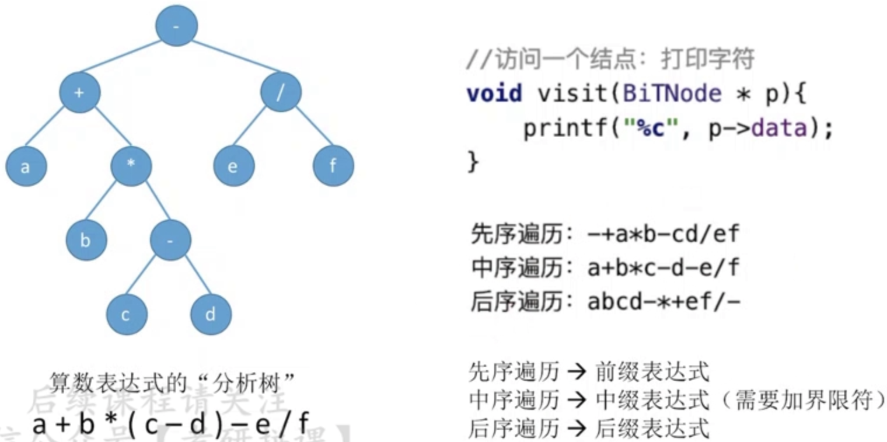

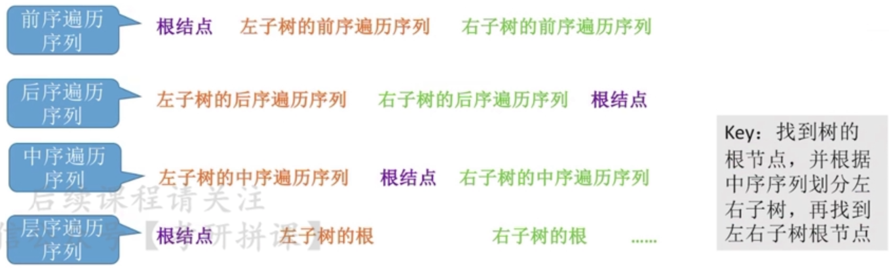

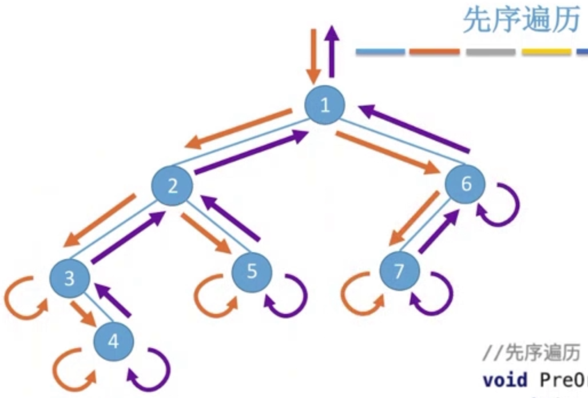

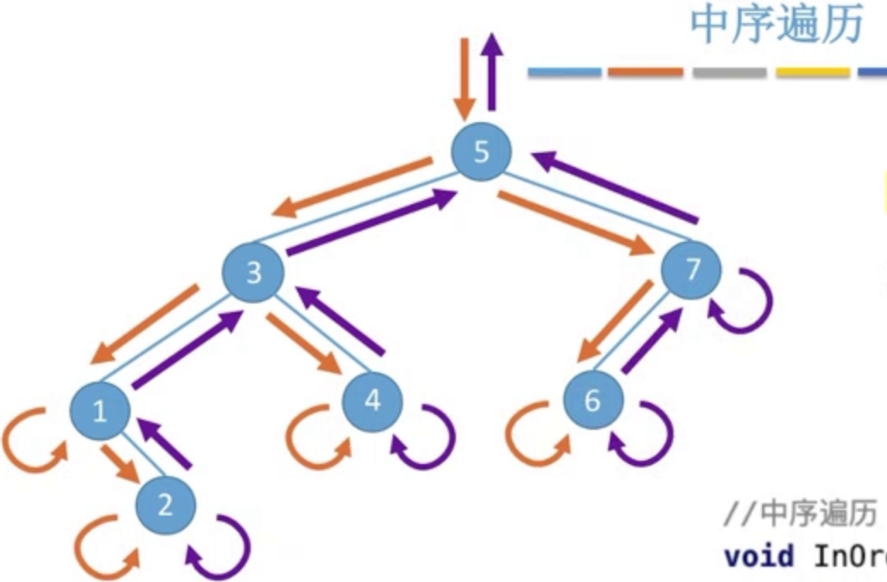

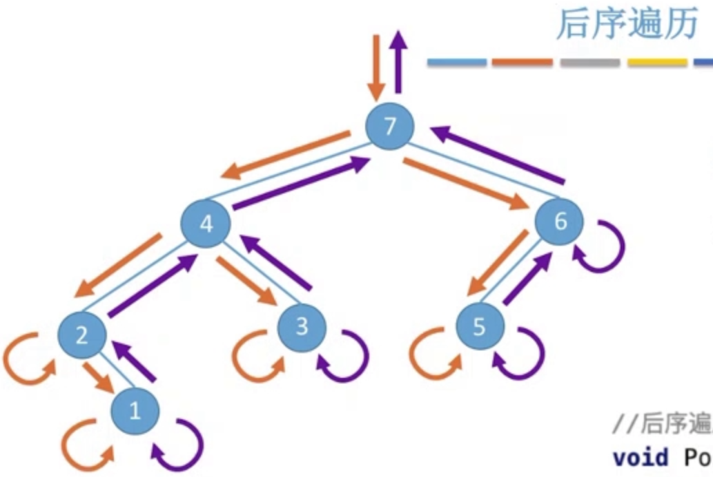

由二叉树的遍历构造二叉树

1. 前序+中序
2. 后序+中序
3. 层序+中序

深度优先遍历：先序遍历，后序遍历

广度优先遍历：层序遍历

#### 线索二叉树

--------------------

指向结点前驱和后继的指针称为线索

若无左孩子，lchild指向前驱结点，若无右孩子，rchild指向后继结点

增加两个标志位：ltag和rtag；tag = 0 时，child指针指向孩子结点；tag = 1 时，child指针指向前驱/后继

##### 中序线索二叉树

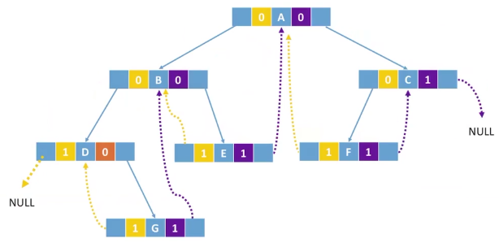

* 中序线索二叉树找指定结点的中序前驱
  * 如果没有左孩子，则左孩子指针指向的就是前驱
  * 如果有左孩子，则遍历左子树的最后一个结点是其前驱（左子树中最右下角的结点）

* 中序线索二叉树找指定结点的中序后继
  * 如果没有右孩子，则右孩子指针指向的就是后继
  * 如果有右孩子，则遍历右子树的第一个结点是其后继（右子树中最左下角的结点）

##### 先序线索二叉树

* 先序线索二叉树找指定结点的先序前驱

  找不到，只能从头遍历或用三叉链表（因为遍历方式是【根、左、右】，所以不可能从左右孩子找到前驱）

  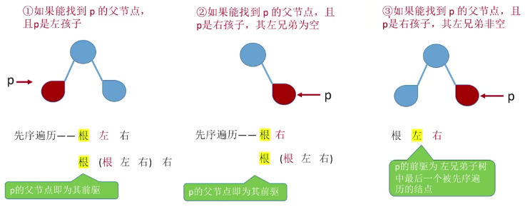

* 先序线索二叉树找指定结点的先序后继
  * 如果没有右孩子，则右孩子指针指向后继
  * 如果有左孩子和右孩子，则左孩子就是后继
  * 如果没有左孩子但有右孩子，则右孩子就是其后继

##### 后续线索二叉树

* 后序线索二叉树找指定结点的后序前驱

  * 如果没有左孩子，则左孩子指针指向前驱
  * 如果有左孩子和右孩子，则右孩子为前驱
  * 如果只有左孩子，则左孩子为前驱

* 后序线索二叉树找指定结点的后序后继

  找不到，只能从头遍历或用三叉链表（因为遍历方式是【左、右、根】，所以不可能从左右孩子找到后继）

  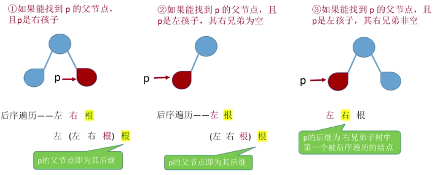

  **总结**

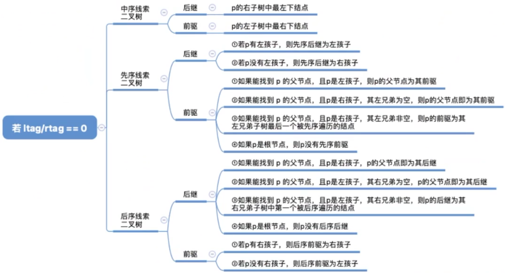

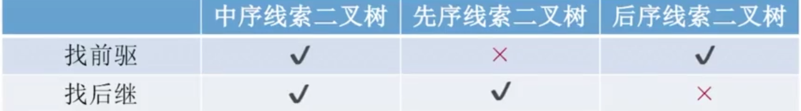

### 树与森林

-------------

#### 树的存储结构

1. 双亲表示法

   以顺序存储作为存储结构

2. 孩子表示法

   以顺序存储 + 链式存储作为存储结构

3. 孩子兄弟表示法（二叉树表示法）

   以二叉链表作为存储结构

二叉树与树的转化：孩子兄弟表示法

森林与二叉树的转化：先将每棵树变成二叉树（孩子兄弟表示法），然后将根结点连接

#### 树与森林的遍历

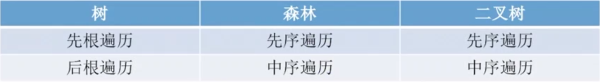

### 二叉排序树

--------------

左子树 < 根结点 < 右子树

通过中序遍历可以得到递增的有序序列

#### 基本操作

##### 查找

从根结点开始，若相等则查找成功，若小于根结点则查找左子树，否则查找右子树

查找长度：对比关键字的次数

平衡二叉树的平均查找长度为 O(log2n)

##### 插入

若原二叉树为空，则直接插入；若小于根结点，则插入到左子树，否则插入右子树

插入的结点一定是叶子结点

##### 删除

1. 若是删除叶子节点，则直接删除
2. 若该节点只有左子树或右子树，则直接删除该节点并让左子树或右子树替代该结点位置
3. 若该结点有两个子树，则令该结点的中序前驱或中序后继替代该结点然后删除该中序前驱或中序后继

###平衡二叉树

---------

平衡因子（左子树与右子树高度差）不超过1

含有n个结点的平衡二叉树最大深度为O(log2n)，平均查找长度为O(log2n)

#### 平衡二叉树的插入

##### LL型

在A的左孩子的左子树插入导致A不平衡，将A的左孩子右上旋

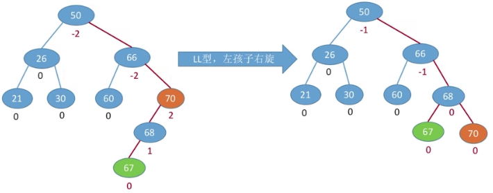

##### RR型

在A的右孩子的右子树插入导致A不平衡，将A的右孩子左上旋

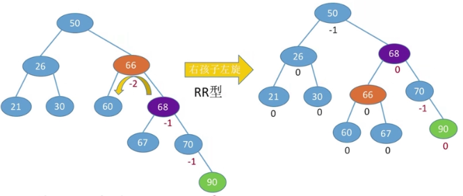

##### RL型

在A的右孩子的左子树插入导致A不平衡，将A的右孩子的左孩子先右上旋再左上旋

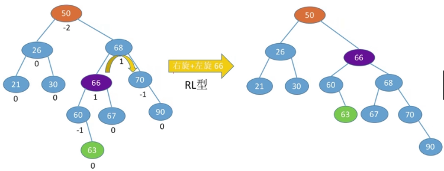

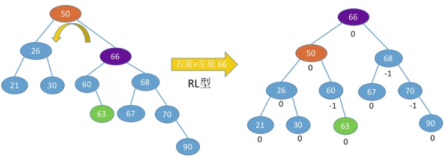

##### LR型

在A的左孩子的右子树插入导致A不平衡，将A的左孩子的右孩子先左上旋再右上旋

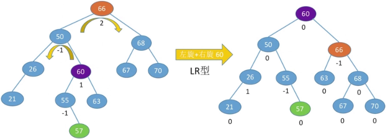

###哈夫曼树

--------

带权路径长度最小的二叉树（最优二叉树）

树的所有叶结点的带权路径长度之和称为该树的带权路径长度

带权路径长度：从树的根结点到任意结点的路径长度（边数）与该结点的权值的乘积。

#### 哈夫曼树的构造

选取两个权值最小的结点进行结合，将新结点的权值置为左右子树结点的权值之和，再与其他权值最小的结点结合

特点：

1. 新建了n-1个结点，共有2n-1个结点
2. 权值越小，路径长度越长
3. 不存在度为 1 的结点
4. 哈夫曼树不唯一

#### 哈夫曼编码

构造哈夫曼树后，将每个结点的左右路径标记为0/1

前缀编码：没有一个编码是另一个编码的前缀，如 0、101、100、111

## 图

### 基本概念

有向图、无向图

生成子图：包含原图所有的顶点的子图

生成树：包含连通图中全部顶点的一个极小连通子图

连通图：任意两个顶点之间都是连通的

强连通：有向图中，顶点a到顶点b以及顶点b到顶点a之间都有路径

强连通图：任意两个顶点之间都是强连通的有向图

连通分量：无向图的极大连通子图

强连通分量：有向图的极大强连通子图

极大连通子图：该连通图包含所有的边

极小连通子图：既要保持连通又要使得边数最少的子图

顶点的度：

1. 无向图顶点的度是依附于该顶点的边的条数
2. 有向图顶点的度是出度和入度之和

路径长度：路径上边的数目

距离：最短路径长度

### 图的存储

---------

#### 邻接矩阵法

用数组实现的顺序存储，空间复杂度高，适合存储稠密图，不适合存储稀疏图，一个图的邻接矩阵唯一

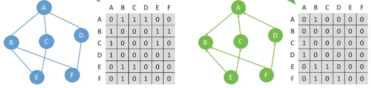

邻接矩阵法的空间复杂度为 O(n2)（n为顶点个数） 

无向图中，第 i 个结点的度等于第 i 行(列)中非零元素的个数

有向图中，第 i 个结点的出度等于第 i 行的非零元素个数；第 i 个结点的入度等于第 i 列的非零元素个数

#### 邻接表法

适合存储稀疏图

有向图中找入度不方便

无向图的邻接表中边结点的数量为2E，有向图的邻接表中边结点的数量为E

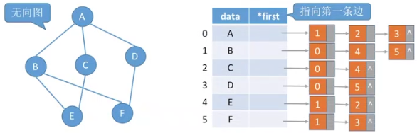

#### 十字链表

**存储有向图**，解决邻接表法存储有向图时不容易找入度的问题

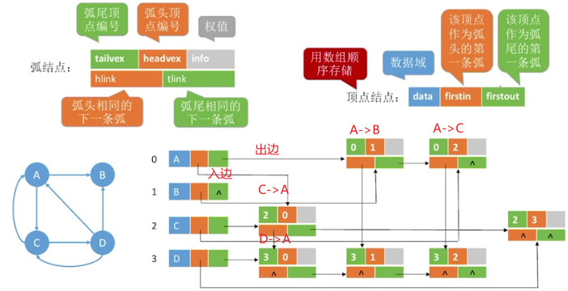

顺着顶点的绿色线路可以找到该顶点的出边

顺着顶点的橙色线路可以找到该顶点的入边

弧结点的方向是从绿色指向橙色（弧尾指向弧头）

#### 邻接多重表

**存储无向图**，解决邻接表法存储无向图时边结点有两份冗余信息的问题以及邻接矩阵空间复杂度高的问题

方便删除边及结点

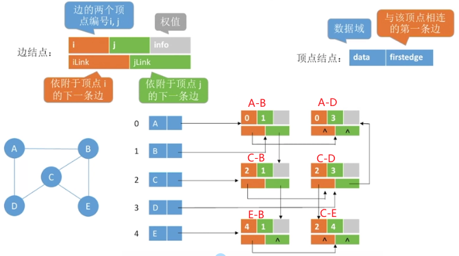

### 图的遍历

-----------

#### 广度优先遍历

类似于树的层序遍历

用邻接矩阵存储的图的广度优先遍历序列唯一

用邻接表存储的图的广度优先遍历序列不唯一，因为邻接表的存储不唯一

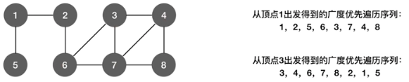

通过广度优先遍历可以得到广度优先生成树，因此，遍历序列不一样则生成树也会不一样

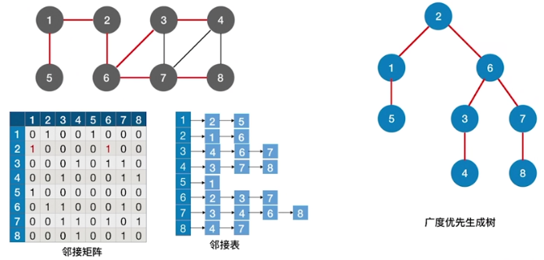

#### 深度优先遍历

类似于树的先序遍历

用邻接矩阵存储的图的深度优先遍历序列唯一

用邻接表存储的图的深度优先遍历序列不唯一，因为邻接表的存储不唯一

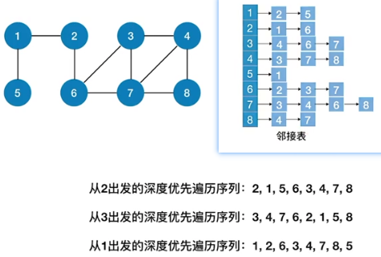

通过深度优先遍历可以得到深度优先生成树，因此，遍历序列不一样则生成树也会不一样

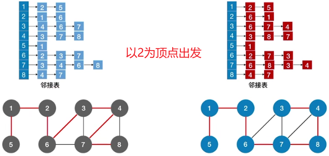

### 最小生成树

--------------

边的权值之和最小的生成树

最小生成树的边数 = 顶点数 - 1，砍掉一条边则不连通，增加一条边则形成回路

最小生成树可能有多个，但是最小生成树的边的权值之和是唯一且最小的

####  Prim算法

适用于边稠密图

从某个顶点开始构建生成树；每次将代价最小的新顶点纳入生成树，直到所有的顶点都纳入为止

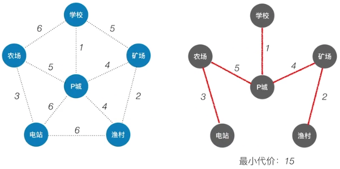

#### Kruskal算法

适用于边稀疏图

每次选择一条权值最小的边，使这条边的两头连通（原本已经联通的就不选），直到所有的结点连通

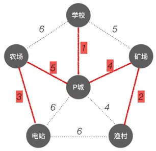

### 最短路径

----------------------

#### BFS算法（广度优先遍历）

> 只适用于无权图或所有权值都相等的图

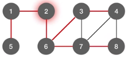

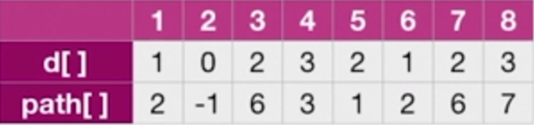

其中d[]记录路径长度，path[]记录前驱结点，用于生成最短路径

#### Dijkstra算法

#### Floyd算法

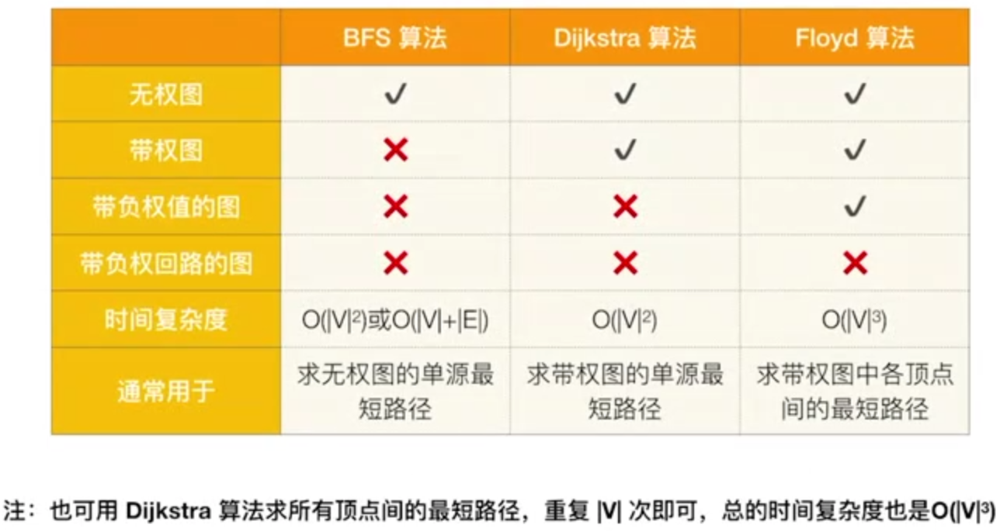

### 有向无环图

--------------

不存在环的有向图，简称DAG图

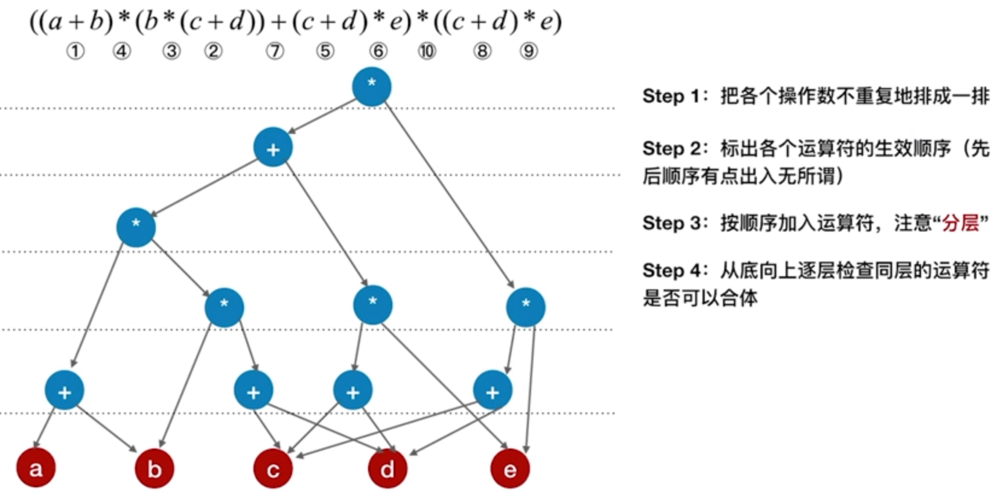

合并结果如下所示

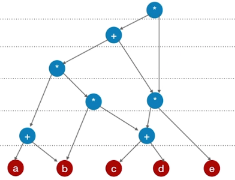

### 拓扑排序

--------

AOV网：顶点表示活动的网络，边无权值

拓扑排序的实现：

1. 从AOV网中选择一个没有前驱的顶点并输出。
2. 从网中删除该顶点和所有以它为起点的有向边。
3. 重复 1 和 2，直到当前的AOV网为空或当前网中不存在无前驱的顶点为止（后一种情况说明有回路）。

AOV网的拓扑排序不唯一

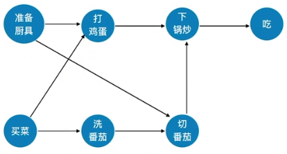

#### 逆拓扑排序

逆拓扑排序的实现：

1. 从AOV网中选择一个没有后继的顶点并输出。
2. 从网中删除该顶点和所有以它为终点的有向边。
3. 重复 1 和 2，直到当前的AOV网为空为止。

### 关键路径

---------------

AOE网：用边表示活动的网络，顶点表示事件，边有权值，以边的权值表示活动开销

AOE网中仅有一个源点（开始顶点）和一个汇点（结束顶点）

关键路径：在所有源点到汇点的路径中，具有最大路径长度的路径，可以理解为完成整个工程的最短时间

关键活动：关键路径上的活动

关键活动缩短到一定时间可能会成为非关键活动

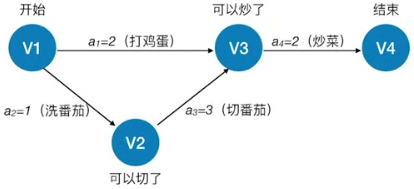

## 查找

###基本概念

查找表（查找结构）：用于查找的数据集合

静态查找表：只用于查找的查找表

动态查找表：需要动态的插入或删除的查找表

关键字：唯一标识该数据项的值

平均查找长度：平均对比关键字的次数，是衡量查找效率的重要指标

### 顺序查找

--------------

通常用于线性表

#### 一般线性表的顺序查找

从头到尾（从尾到头）的查找

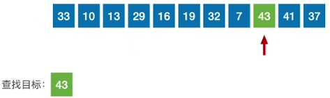

平均查找长度：O(n)

#### 有序表的顺序查找

当要查找的关键字大于 i 且小于 i+1 时，查找失败。

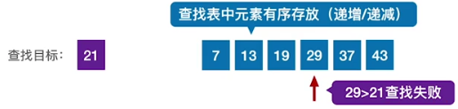

平均查找长度：O(n)

### 折半查找（二分查找）

-------------

仅适用于有序（递增或递减）的顺序表

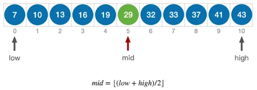

折半查找判定树是一个平衡二叉排序树，折半查找的次数不会超过树的高度

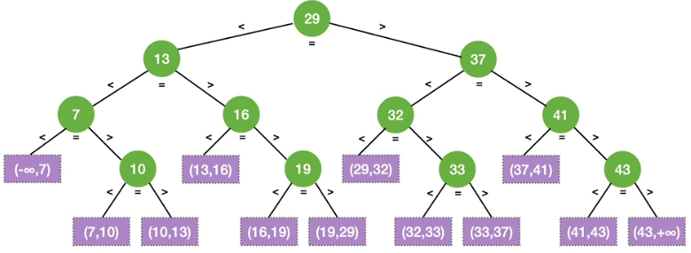

时间复杂度：O(log2n)

### 分块查找

-------------

特点：块内无序，块间有序

索引表中保存每个分块的最大关键字和存储区间，索引表按关键字有序排列

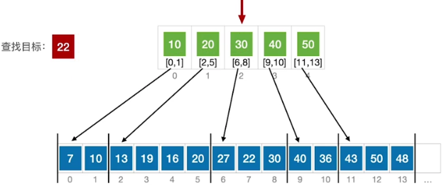

平均查找长度 = 索引表的平均查找长度 + 块内查找的平均查找长度

当有n个元素，分成√n个索引，每个索引有√n个记录时，平均查找长度最小为√n+1

### B树

---------------

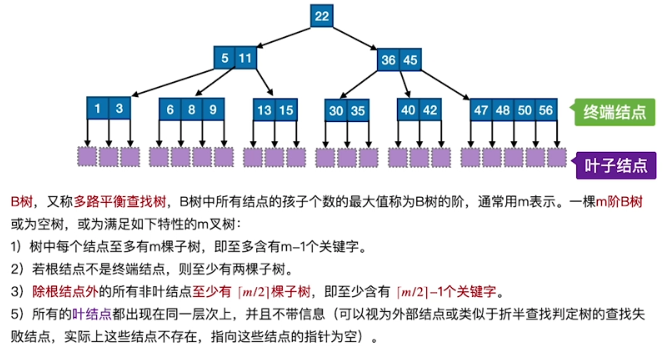

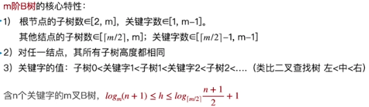

B树的高度不包括叶子节点的一层，n个关键字的B树有n+1个叶子节点

#### B树的插入

开始插入的位置一定是终端结点

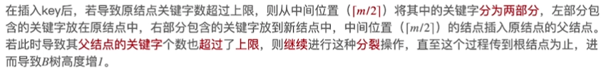

#### B树的删除

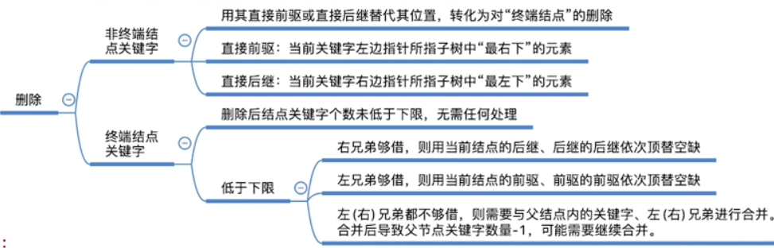

### B+树

-----------

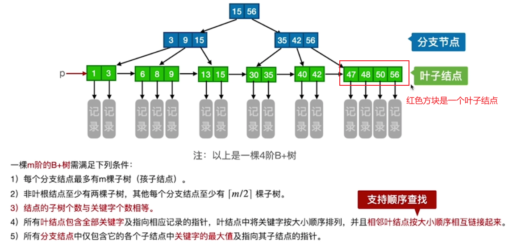

B+树的非叶结点仅起到索引作用

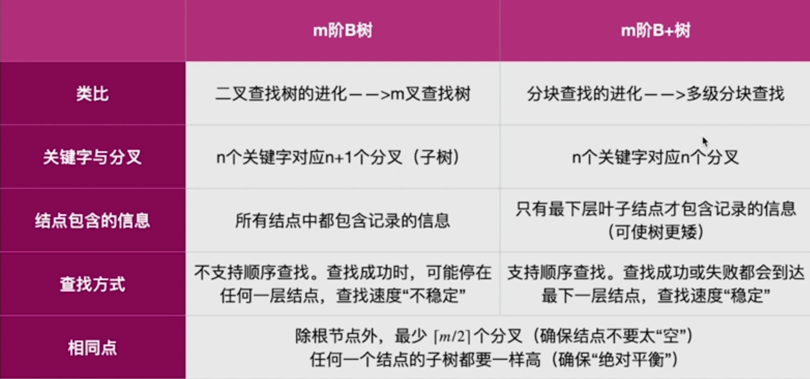

### 散列查找

-------------

散列查找是典型的“空间换时间”算法

散列函数（哈希函数）：把查找表中的关键字映射成该关键字对应地址的函数

散列表（哈希表）：根据关键字而直接进行访问的数据结构

冲突：不同的关键字映射到了同一个地址

同义词：发生冲突的关键字

装填因子 = 表中记录数/散列表长度

散列表的平均查找长度和装填因子有关，不单单和表中记录数或散列表长度有关。

#### 散列函数构造方法

1. 直接定址法

   线性映射

2. 除留余数法

   取一个不大于表长m但最接近m或等于m的质数p

3. 数字分析法

   例如手机号，用后四位构造散列表

4. 平方取中法

#### 解决冲突的方法

##### 拉链法

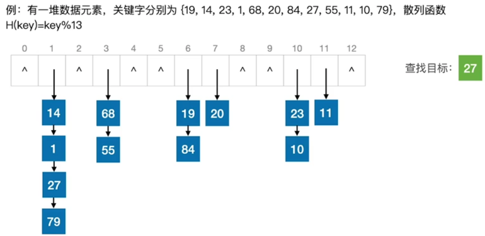

适用于经常插入和删除

##### 开放定址法

表项可以存放非同义词

主要有线性探测法

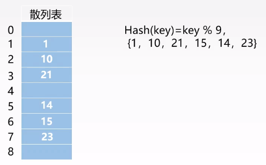

易产生“堆积”现象（鸠占鹊巢）

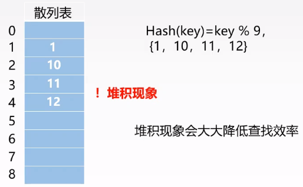

不能随便删除某个元素，因为可能会截断其他具有相同散列规律的元素的查找

## 排序

算法的稳定性：对于 a 和 **a**，排序前 a 在 **a** 前面，排序后 a 仍在 **a** 前面

内部排序：排序在内存中进行

外部排序：排序在内外存之间进行

### 插入排序

#### 直接插入排序

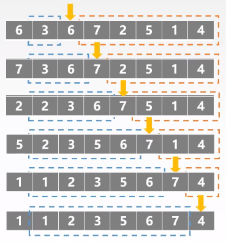

#### 折半查找排序

用于顺序表，仅仅缩短了比较次数

#### 希尔排序

对每个分组分别进行直接插入排序

仅适用于顺序表

### 交换排序

#### 冒泡排序

从后往前（从前往后）两两比较相邻元素的值，若为逆序则交换它们

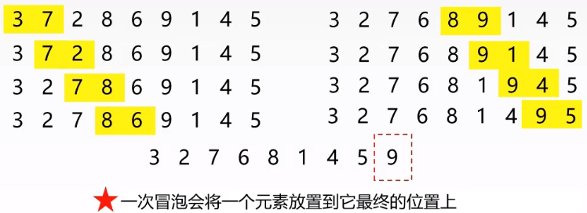

#### 快速排序

从基准数的对面开始移动

当关键字基本有序或基本逆序时，时间复杂度最高

### 选择排序

#### 简单选择排序

每次选择一个最小的放在前面（递增排序情况下）

时间复杂度与初始序列无关

#### 堆排序

##### 小根堆

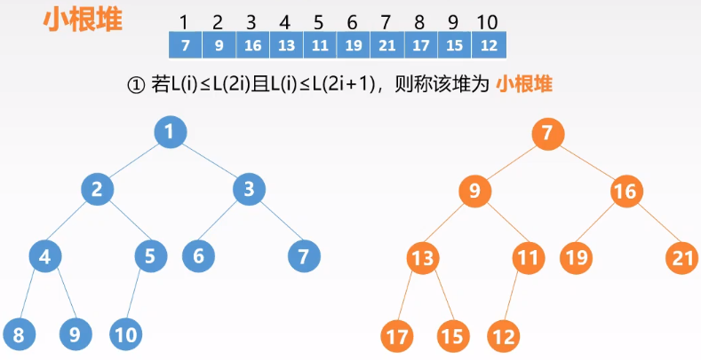

小根堆中，如果双亲结点大于孩子结点则交换

##### 大根堆

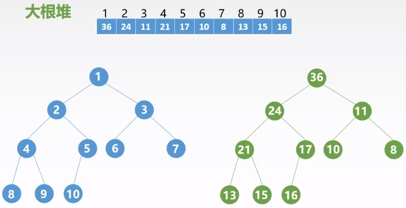

大根堆中，如果双亲结点小于孩子结点则交换

##### 堆的输出

不断输出堆顶元素，将堆顶元素与堆的最后一个元素交换，并不断向下调整

##### 堆的插入

将新结点放在末端并不断向上调整

### 归并排序

不断的将两个或两个以上的有序表合并成一个有序表

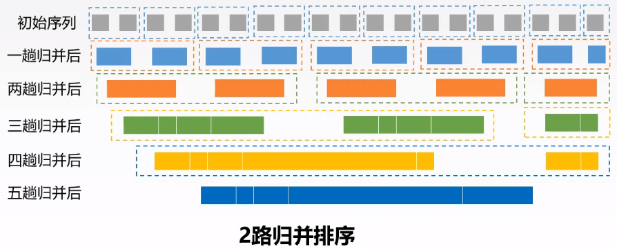

每次取出2个组中的头元素进行比较，小的先放入下一组

### 基数排序

不基于比较和移动

分为最低位优先和最高位优先

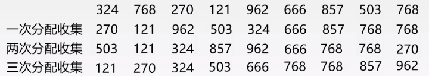

### 内部排序算法的比较

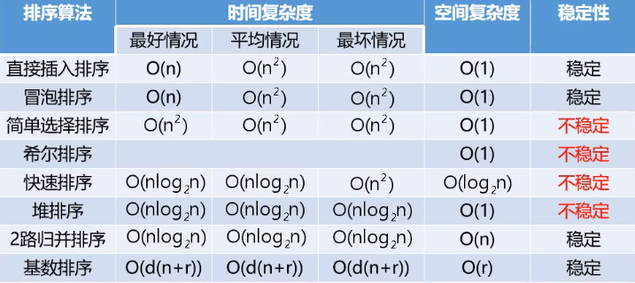

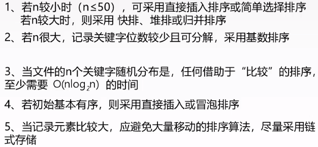