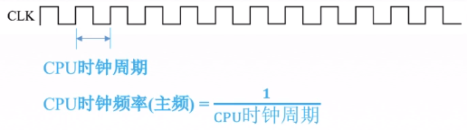

# 计算机组成原理

## 计算机系统概述

### 计算机硬件的发展

1. 第一代——电子管时代
2. 第二代——晶体管时代
3. 第三代——中小规模集成电路时代
4. 第四代——超大规模集成电路时代

### 系统结构

硬件组成部分

> 冯诺依曼结构计算机以运算器为中心，主存储器也叫内存，辅助存储器也叫外存，如硬盘

### 计算机的性能指标

1. 机器字长：计算机进行一次定点整数运算所能处理的二进制数据的位数，一般等于内部寄存器的大小
2. 数据通路带宽：数据总线所能一次并行传送信息的位数
3. CPU时钟周期：主频的倒数
4. CPI：执行一条指令所需要的时钟周期数

存储容量：总容量 = 存储单元个数x存储字长/8 （单位B）

机器字长：计算机进行一-次整数运算所能处理的二进制数据的位数

CPI：执行一条指令所需要的时钟周期数

IPS = 主频/CPI  （每秒钟执行多少条指令）

计算机采用二进制是为了方便对应物理器件的状态，如高电平、低电平

### 进制转换

#### 任意进制转换成十进制

#### 十进制转换成任意进制

#### 2、4、8、16进制转换

> 任意进制转换成十进制：按权展开相加法
>
> 十进制转换成任意进制：整数部分除基取余法，小数乘基取整法；也可以用拼凑法
>
> 2、4、8、16进制转换，分组转换法，三个2进制位对应一个8进制位，**注意补位**

真值与机器数

真值：符合人类习惯的数字

机器数：正负号被数字化

+15——> 01111

-8 ——> 1111

#### BCD码（8421码）

### 字符的大端模式 与小端模式

假设每个存储单元存储四个字节

### 校验码

#### 奇偶校验码

奇校验码只能校验1的个数不为奇数时的错误，同理偶校验码只能校验出1的个数不为偶数时的错误

#### 海明码

#### 循环冗余校验码

## 存储系统

### 分类

#### 按层次

1. 主存储器
2. 辅助存储器
3. 高速缓冲存储器

#### 按介质

1. 磁表面存储器
2. 半导体存储器
3. 光存储器

#### 按存取方式

1. 随机存储器
2. 只读存储器
3. 串行访问存储器

#### 按断电可保存性

1. 易失性存储器
2. 非易失性存储器

### RAM

#### SRAM

#### DRAM

### ROM

