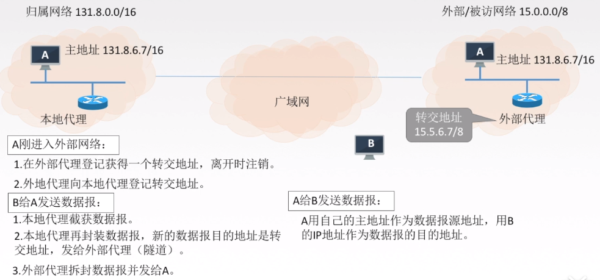
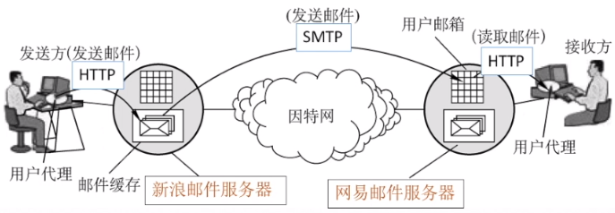
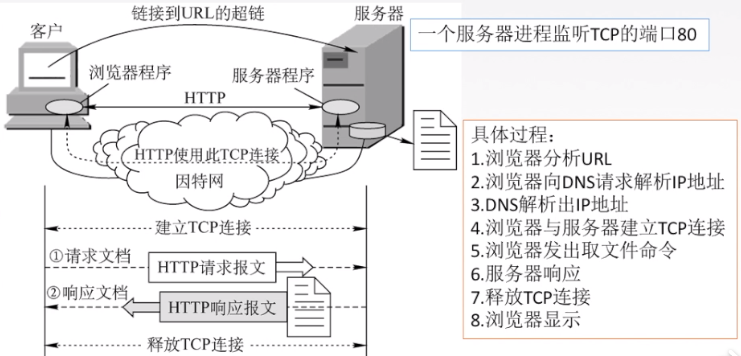

# 计算机网络

## 计算机网络体系结构

### 概念

计算机网络：将分散的、具有独立的功能的计算机系统，通过通信设备与线路衔接起来，由功能完善的软件实现资源共享和信息传递的系统

计算机网络是一个自治的、互联的计算机系统的集合

### 功能

1. 数据通信
2. 资源共享
3. 分布式处理：多台计算机承担同一任务的不同部分
4. 提高可靠性：可以互为替代机
5. 负载均衡：将工作任务均衡的分配给各台计算机

### 组成

> 组成部分：硬件、软件、协议
>

#### 按工作方式

* 边缘部分（用户直接使用）
  
  主要有主机构成

  * C/S方式
  * P2P方式
  
* 核心部分（为边缘部分服务）

  由路由器和网络组成

#### 按功能组成

* 通信子网：实现数据通信，各种传输介质、通信设备、相应的网络协议的组成
* 资源子网：实现资源共享/数据处理的设备和软件的集合

### 分类

#### 按分布范围

1. 广域网
2. 城域网
3. 局域网
4. 个人区域网

#### 按传输技术

1. 广播式
2. 点对点式

#### 按拓扑结构

1. 总线形
2. 星形（逻辑上是总线形）
3. 环形
4. 网状形

#### 按使用者

1. 公用网
2. 专用网

#### 按交换技术

1. 电路交换
2. 报文交换
3. 分组交换

#### 按传输介质

1. 有线网
2. 无线网

### 标准化及组织

标准

* 法定标准：如ISO
* 事实标准：如TCP/IP

相关组织

* 国际标准化组织 ISO
* 国际电信联盟 ITU
* 国际电气电子工程师协会 IEEE

### 性能指标

速率也叫比特率，1kb/s=1000b/s，倍率是1000，单位b/s，kb/s，Mb/s

带宽：数字信道所能传送的最高速率，单位b/s，kb/s，Mb/s

吞吐量：单位时间内通过某个网络（或信道、接口）的数据量，单位b/s，kb/s，Mb/s

**时延**：数据从网络一端发送到另一端所需的时间，单位`s`

**时延 = 发送时延（传输时延）+ 传播时延 + 排队时延 + 处理时延**

传输时延=数据长度/信道带宽，从第一个比特发出到最后一个比特发出所需要的时间

传播时延=信道长度/电磁波在信道上传播的速率

排队时延：等待输入/输出链路可用的时延

处理时延：检错、找出口的时延

> 传输时延：集线器 < 网桥 < 交换机 < 路由器

**时延带宽积**

可以理解为从发送第一个比特到达链路终点时，发送端已经发送了多少比特，即某段链路现在有多少比特

时延带宽积(b)=传播时延(s)*带宽(b/s)

**往返时延RTT**

从发送到发送方收到确认的时间

RTT越大，在收到确认之前，可以发动的数据越多

RTT包括两倍的传播时延和末端处理时间

**利用率**

信道利用率：有数据通过的时间/总的（有+无）数据通过时间

网络利用率：所有信道利用率的加权平均值

利用率越大，时延越大，信道越堵塞

### 网络分层结构

> 各层之间相互独立，每层只实现一种相对独立的功能
>
> 单向服务，下层只能为上层提供服务
>
> 仅在相邻层之间有接口

#### 计算机网络服务

1. 面向连接服务：通信前要建立连接

   无连接服务：通信前不需要建立连接

2. 可靠服务：具有纠错、检错、应答机制等保证数据准确安全的传送

   不可靠服务：尽力而为的服务，尽量准确、可靠的传送

3. 有应答服务：接收方收到信息后给予发送方应答，该应答由传输系统内部自动实现

   无应答服务：接收方收到数据后不发送应答

#### OSI参考模型

PDU（协议数据单元） = PCI（协议控制信息） + SDU（服务数据单元）

> 1、2、3层是点到点通信，4、5、6、7是端到端通信

* 应用层：所有能和用户交互产生数据流量的程序，典型的应用层协议有FTP、HTTP、SMTP等
  * 功能1：文件传输、访问和管理
  * 功能2：电子邮件
  * 功能3：虚拟终端
  * 功能4：查询服务和远程作业登录
* 表示层：用于处理两个通信系统之间交换信息的表示方式（语法和语义）
  * 功能1：数据格式转换
  * 功能2：数据加密解密
  * 功能3：数据压缩和恢复
* 会话层：向表示层实体/用户进程提供建立连接并在连接上有序的传输数据，也是建立同步
  * 功能1：建立、管理、终止会话
  * 功能2：使用校验点可以使会话在通信时效时从校验点/同步点继续恢复通信，实现数据同步
* 传输层：**负责端到端的进程间通信**，**PDU（数据单元）为报文**  主要协议有TCP/UDP
  * 功能1：可靠传输（大文件）、不可靠传输（小文件）
  * 功能2：差错控制（检错纠错）
  * 功能3：流量控制（控制传输的速度，考虑接受能力）
  * 功能4：复用分用
  * 功能5：拥塞控制
* 网络层：把分组从源端传到目的端，**PDU为分组**，数据报可以分成多个分组
  * 功能1：路由选择（最佳路径）
  * 功能2：流量控制
  * 功能3：差错控制
  * 功能4：拥塞控制
* 数据链路层：把网络层传下来的数据报组装成帧，**PDU为帧**
  * 功能1：成帧（定义帧的开始和结束）
  * 功能2：差错控制
  * 功能3：流量控制
  * 功能4：访问控制（控制对信道的访问）
* 物理层：在物理媒体上实现比特流的透明传输，**PDU为比特**
  * 功能1：定义接口特性
  * 功能2：定义传输模式（单工、半双工、双工）
  * 功能3：定义传输速率
  * 功能4：比特同步
  * 功能5：比特编码

> 路由器、交换机、集线器实现的最高功能层分别是网络层、数据链路层、物理层

#### TCP/IP参考模型

> 因特网使用的IP协议时无连接的

#### 5层参考模型

> 大的报文会被分割成报文段，数据报过大会被切割成分组（网络层）
>

## 物理层

### 数据通信

#### 数据通信模型

**数字信号**：代表消息的参数取值是离散的，如高电平、低电平

**模拟信号**：代表消息的参数取值是连续的

**信道上传送的信号**

* **基带信号**：将**数字信号**0、1直接用两种电压表示，送到**数字信道**上传输**（基带传输）**
* **宽带信号**：将基带信号调制后的**模拟信号**，送到**模拟信道**上传输，把信号调制成高频信号**（宽带传输）**

近距离传输采用基带传输（衰减较小），远距离采用宽带传输（衰减较大）

**信道**：信号的传输媒介

* 按传输信号分
  * 模拟信道
  * 数字信道
* 传输介质
  * 无线信道
  * 有线信道

#### 通信方式

* 单工：单向通信，只有一个信道
* 半双工：双向通信，但不能同时收发，需要两个信道
* 全双工：双向通信，可同时收发，需要两个信道

#### 传输方式

* 串行传输：适用于远距离传输
* 并行传输：适用于近距离传输

#### 码元

码元是指用一个固定时长的信号波形（数字脉冲），代表不同离散数值的基本波形，是数字通信中数字信号的基本单位。一个码元可以携带多个比特的信息量。

> 二进制码元（2种状态）中有0和1两种码元状态，4进制码元（四种状态）中有00，01，10，11四种码元状态，16进制码元（16种状态）有0000—1111种码元状态，几进制就是有几种不同状态的码元
>

#### 速率

##### 码元传输速率

也叫码元速率、调制速率、波形速率、符号速率

1s传输的码元个数（或者脉冲个数、信号变化的次数），单位是波特 1码元/s=1波特，码元速率与进制数无关

##### 信息传输速率

也叫信息速率、比特率

1s传输的比特个数，单位是b/s

若一个码元携带n个比特的信息量，那么M波特的码元传输速率所对应的信息传输速率是M*n  b/s

#### 影响信号失真的因素

* 码元传输速率
* 信号传输距离
* 噪声干扰
* 传输媒体质量

> 信号带宽：信道能通过的最高频率与最低频率只差
>
> 码间串扰：码元传输速率过快导致接收端收到的信号失去了码元之间清晰界限的现象

#### 奈氏准则

在理想低通（无噪声，带宽受限）条件下，为了避免码间串扰，极限**码元传输速率**为**2W**波特，W是信道带宽，单位HZ。

理想低通信道下的极限信息传输速率 = 2Wlog2V (b/s)，（V是有几种码元）

要想提高数据率就要提高带宽/采用更好地编码技术

#### 香农定理

在带宽受限且有噪声的信道中，为了不产生误差，信息传输速率有上限值

信道的极限传输速率 = Wlog2(1+S/N) (b/s) ，信噪比 = S/N，有时也用分贝表示

信噪比（dB）= 10log10S/N

要想提高数据率就要提高带宽与信噪比

### 编码与调制

#### 数字信号编码成数字信号

1. 非归零编码：高 1 低 0 （或相反），无法自同步
2. 归零编码：在一个码元内都要恢复成0
3. 反向不归零编码：信号电平翻转表示0，不翻转表示1
4. 曼彻斯特编码：前高后低表示1，前低后高表示0，也可相反规定
5. 差分曼彻斯特编码：若为1则前半个码元电平与上一个的后半个码元电平相同，反之为0（同1异0）
6. 4B/5B编码：用5个比特编码4个比特的数据，编码效率为80%

> 非归零编码和归零编码以及反向不归零编码不能满足同是1或同是0的情况判断，不携带时钟信号不能实现自同步
>
> 在曼彻斯特编码和差分曼彻斯特编码中，每个码元都分成了两个电平（电平变化两次），码元传输速率为信息传输速率的两倍，这两种编码都携带时钟信号（跳变），可以实现自同步

#### 数据信号调制成模拟信号

还有一种是**QAM（调幅+调相）**

#### 模拟信号编码成数字信号

在音频方面，将声音的模拟信号转换成数字信号，用到脉码调制（PCM），包括采样、量化、编码

> 在采样时要满足F（采样频率）≥2F（信号最高频率）
>

#### 模拟信号调制成模拟信号

利用频分复用技术，一般是变成高频信号

### 数据交换

#### 电路交换

阶段：建立连接、通信、释放连接。

时延最小，建立连接时间长，线路独占，有序传输，没有冲突，例如电话网络

#### 报文交换

无须建立连接，有存储转发，动态分配线路，线路利用率和可靠性提高，要求网络结点要有较大的缓存空间

#### 分组交换

无须建立连接，有存储转发，相较于报文交换简化了存储管理，线路利用率高，出错率下降，存在传输时延

##### 数据报方式

为网络层提供无连接服务，每个分组携带源地址和目的地址，不独占线路，不可靠传输，分组不一定按顺序到达，互联网使用此方式

##### 虚电路方式

为网络层提供连接服务，将数据报方式和电路交换方式结合，先发送连接请求，收到连接应答后建立逻辑上的连接，每个分组都携带虚电路号而非目的地址，全双工通信

“虚电路”，因为这条电路不是专用的，每个结点到其它结点之间的链路可能同时有多个虚电路通过，每个结点可以和多个结点之间建立虚电路

### 物理层传输介质

#### 导向传输介质

*  双绞线

  * 屏蔽双绞线（有屏蔽层）
  * 非屏蔽双绞线

  对于远距离传输**模拟信号**，要用**放大器**放大衰减的信号

  对于远距离传输**数字信号**，要用**中继器**将失真的信号整形

* 同轴电缆

* 光纤

  * 单模光纤
  * 多模光纤

#### 非导向传输介质

* 电磁波：信号向所有方向传播，例如手机通信
* 微波：信号固定方向传播，例如地面微波接力通信、卫星通信
* 红外线/激光：信号固定方向传播，需要把信号转换成红外光信号格式和激光信号格式再在空间中传播

#### 物理层接口的特性

1. 机械特性：规格、引线或引脚的数量
2. 电气特性：电压高低、阻抗匹配、传输速率等
3. 功能特性：某一电平的电压表示何种含义
4. 规程特性：工作规程和时序关系

### 中继器

功能：再生数字信号，对信号进行再生和还原。两端的网段使用同一协议

5-4-3规则：互相串联的中继器个数不能超过4个，在这5段通信链路中只有3段可以挂接计算机

### 集线器（多口中继器）

功能：对信号进行再生、放大。不具备定向传送能力，是一个标准的共享式设备

## 数据链路层

### 为网络层提供服务

1. 无确认的无连接服务，如以太网
2. 有确认的无连接服务，如无线通信
3. 有确认的面向连接服务

数据链路层分为逻辑链路层LLC子层和介质访问控制MAC子层

### 组帧

组帧主要解决帧定界、帧同步、透明传输等

封装成帧：在一段数据前后添加首部和尾部，定义帧的起始和结束

**透明传输**：不管所传数据是什么都能在链路上传送，当所传数据中的比特组合恰巧与某一个控制信息一样时，要采取措施使得接收方不会将该数据误认为是某种控制信息，这样就就保证了传输是透明的

实现组帧的方法：

1. 字符计数法

   在帧的头部使用一个计数字段来标明帧内字符数目，但一旦出现计数字段出错，则后续的帧都会出错

   

2. 字符填充法

   在数据中与首尾控制信息出现重复的字符前添加转义字符

   

3. 零比特填充法

   以01111110作为起始和结束标志，在信息位中，如果出现连续的5个1，就在后面添加一个0，接收方在查看到连续的5个1后会把后面的0删除

   

4. 违规编码法

   由于曼彻斯特编码只有"高-低"和"低-高"，用"高-高"、"低-低"来规定帧的起止

### 差错控制

位错和帧错，位错指帧中某些比特位出错，帧错包括丢失、重复、失序等

> 可靠传输：数据链路层发送端发送什么，接收端就接受什么，不管对错

> 因为数据链路层对数据有错误就丢弃，做到无差错接收，所以凡是接收端数据链路层收到的帧，我们都以接近于1的概率认为这些帧在传输过程中没有差错

* 检错编码（冗余编码）
  * 奇偶校验码：只能检查出奇数个错误
  
  * 循环冗余码CRC
  
    FCS的生成和接收端CRC的检验都是硬件实现的
  
    * 加0：假设生成多项式的阶为r，则加r个0
    * 模2除法：数据加0后除以多项式，余数为冗余码（FCS）
  
    
* 纠错编码
  
  * 海明码：发现双比特错，纠正单比特错

### 流量控制

#### 停止-等待协议

发送窗口

每发完一个就停止等待确认，确认后再发送，不确认一直等待，会导致信道利用率太低

每发送一个帧就会启动一个超时计时器，ACK（确认帧）超时自动重传

发送端在发送完后必须在其缓存中保留此数据帧的副本，这样才能在出错后重传

#### 后退N帧协议（GBN）

发送方必须响应的三件事

1. 上层的调用：上层要发送数据，要先检查发送窗口是否已满，若已满则返回上层稍后发送
2. 收到ACK（确认帧）：对N号帧采用**累计确认**，不需要一个个确认表明接收方已经收到了N号帧和它之前的全部帧
3. 超时事件：若出现超时，发送方会重传所有已发送但未被确认的帧

接收方要做的事

1. 如果收到N号帧，并且按序，那么接收方为N帧发送一个ACK，并将数据交付给上层
2. 其余情况全部丢帧，并为最近按序接收的帧重新发送ACK

> 总结：
>
> 1. 累计确认（偶尔捎带确认）
> 2. 接收方只按序接收帧，不按序则丢弃
> 3. 确认序列号最大的、**按序**到达的帧
> 4. 若采用 n 比特对帧编号，发送窗口最大为 2n-1，接收窗口为1
> 5. 缺点：会重传已发送的正确的帧

#### 选择重传协议（SR）

**每个帧都单个返回确认**，同时加大接收窗口，设置接收缓存，缓存乱序到达的帧

接收窗口不能超过发送窗口大小，一般接收窗口数量等于发送窗口数量，最大为 2n-1（若采用 n 位比特对帧编号）

发送方：当超时后只重传出错的帧

接收方：接收发送过来的正确的帧，不管是否按顺序，失序的帧将被缓存，接收窗口外的帧将被丢弃

### 介质访问控制

#### 信道划分介质访问控制（静态划分信道）

> 提前划分信道，不会产生冲突

##### 频分多路复用（FDM）

共享时间，不共享空间

将多路基带信号调制到不同频率载波上，再叠加成一个复合信号，适合模拟信号

在分配到某个频带后，自始至终都占用着这个频带，总和不超过总带宽

##### 时分多路复用（TDM）

共享空间，不共享时间

把时间分配成若干相等的时间片，轮流的给多个信号使用，适合数字信号，用户平分带宽

统计时分多路复用：动态分配时隙，当终端有数据要传送时才会分配到时间片，单个用户可占满带宽

##### 波分多路复用（WDM）

共享时间，不共享空间

其实就是光的频分多路复用，在一根光纤中传输不同的波长（频率）的光信号

##### 码分多路复用（CDM）

既共享时间，也共享空间

码分多址、相互正交、线性相加、规格化内积

#### 随机访问介质访问控制（动态分配信道）

> 所有用户可随机发送信息，占用全部带宽，会产生冲突

##### ALOHA协议

冲突检测：如果收不到确认帧则认为发生了冲突，则会重发

1. 纯ALOHA协议

   不监听信道，随机发送，冲突后随机重发（想发就发）

   

2. 时隙ALOHA协议

   把时间分成若干时间片，若冲突，则在一个随机的时间片开始时刻发送（只有在时间片开始时才能发）

   

##### CSMA协议

发送之前先监听信道（先听再发）

冲突检测：监测总现场的电压摆动值，如果值过大则认为信道发生了冲突，则会等待

1. 1-坚持CSMA

   空闲则直接传输，忙则持续等待，一旦空闲则立即发送（发送概率为1）

   如果有冲突则等待一个随机时间再监听发送

   缺点：如果有两个或以上的结点在监听信道，则必然会发生冲突

2. 非坚持CSMA

   空闲则直接发送，忙则等待一个随机的时间再来监听发送

3. p-坚持CSMA

   空闲则以p的概率直接发送，以1-p的概率等到下一个时隙发送，如果忙则持续监听直至空闲

##### CSMA/CD协议

适用于总线形网络或半双工网络（有线连接）

> 先听后发，边听边发，冲突停发，随机重发

如果在两倍的端到端传播时延内没有发生冲突，则发送不会产生冲突

为了在传输时候能检测书冲突，则必须有一个最小帧长（如果帧太短，遇到冲突的时候就发完了，不能停发）

最小帧长 = 2 * 总线传播时延 * 数据传输率         （以太网规定最小帧长是64B）

确定重传时间：**截断二进制指数退避算法**

##### CSMA/CA协议

适用于无线网络，CA指碰撞避免，如果信道正忙则会采用**截断二进制指数退避算法**

隐蔽站：当A和C都要给B发送数据，当都检测不到信号时，认为信道空闲，都给B发送数据，则会产生碰撞，则A相对于C（或C相对于A）就是隐蔽站

#### 轮询访问介质访问控制（动态分配信道）

> 不会产生冲突，发送时占全部带宽

##### 令牌传递协议

令牌：一个不含任何信息的控制帧

主要应用于令牌环网，适用于负载较重的网络

### 局域网

简称LAN，使用广播信道，以双绞线为主流传输介质

#### 局域网拓扑结构

* 星型拓扑：可靠性低，网络共享能力差，有单点故障问题
* 总线型拓扑：可靠性高，共享能力强，单个节点出问题影响不大
* 环形拓扑：有单点故障问题，环路封闭不利于扩充
* 树形拓扑：易拓展，有单点故障问题

#### 局域网介质访问控制方法

1. CSMA/CD，常用于总线型局域网
2. 令牌总线，常用于总线型局域网
3. 令牌环：用于环形局域网，如令牌环网

#### 局域网的分类

1. 以太网：应用最广泛的局域网，逻辑拓扑总线型，物理拓扑是星型或拓展星型，使用CSMA/CD，采用IEEE802.3标准
2. 令牌环网：物理拓扑是星型，逻辑拓扑是环形，已基本不用
3. FDDI网：物理拓扑是双环拓扑，逻辑拓扑是环形拓扑
4. ATM网
5. 无线局域网（WLAN)：采用IEEE802.11标准

#### 以太网

采用CSMA/CD技术

采用的两个标准：DIX Ethernet V2、IEEE 802.3

提供无连接不可靠的服务，只能实现无差错接收，不实现可靠传输

逻辑拓扑总线型，物理拓扑是星型 ，采用曼彻斯特编码

MAC帧格式：

> MAC地址是计算机硬件地址（物理地址），长6字节（48位），常用12个十六进制数表示，如02-60-8C-E4-B1-21	
>
> 以太网的传送单元MTU是46~1500字节
>

#### 无线局域网

采用IEEE 802.11标准

* 有固定基础设施无线局域网

  

* 无固定基础设施无线局域网自组织网络：没有路由器集线器等，只有主机，各结点地位平等

  

### 广域网

#### PPP协议

LCP来建立并维护数据链路的连接，可用于身份验证

PPP协议可支持多种网络层协议，每一种协议需要一个NCP来配置

PPP协议提供差错检测不提供纠错功能，只支持全双工链路，是面向字节的，可透明传输，是不可靠传输

#### HDLC协议

HDLC是面向比特的，只支持全双工通信，提供差错检测不提供纠错功能，是可靠传输，可实现透明传输

### 数据链路层设备

#### 网桥

透明网桥：即插即用设备，自学习，不选择最佳路由

源路由网桥：在发送帧时，先“探路”，然后把详细的最佳路由信息（时间最短）放在帧的首部

#### 交换机

本质是多端口网桥，根据目的地址的MAC地址来进行转发

直通式交换机：查完目的地址就立刻转发，可靠性低，不检错，不支持具有不同速率的端口的交换

存储转发式交换机：将帧放入高速缓存并检查，正确则转发，错误则丢弃

## 网络层

### 网络层功能

1. 异构网络互联
2. 路由与转发
   1. 路由选择：选择路由路径
   2. 分组转发：将IP数据报从端口转发
3. 拥塞控制：若所有结点都来不及接收分组而丢弃大量分组时，就处于拥塞状态
   1. 开环控制：事先预防
   2. 闭环控制：动态监测

### 路由算法与路由协议

* 静态路由算法（非自适应路由算法）：管理员手工配制路由信息，用于小型网络
* 动态路由算法（自适应路由算法）：路由器间彼此交换信息，按照路由算法优化，用于大型网络
  * 全局性：所有的路由器掌握完整的网络拓扑和链路费用信息，如链路状态路由算法
  * 分散性：路由器只掌握物理相连的邻居和链路费用信息，如距离-向量算法

#### 距离-向量路由算法（RIP协议）

每一个路由器都维护从他自己到其他每一个目的网络的唯一最佳距离（跳数）记录

直接交付的跳数为1，每经过一个路由器跳数加1，一条路径最多有15跳，当距离为16时，表示网络不可达，每30秒和相邻路由器交换一次路由信息，如果180秒没有收到相邻路由器的信息，则认为相邻路由器不在了

仅和相邻路由器交换信息，交换的信息是自己的路由表，会出现“慢收敛”（坏信息传得慢）

RIP是应用层协议，RIP选择的路径时间不一定最短，但经过的路由器一定最少

常用于小型网络

#### 链路状态路由算法（OSPF协议）

使用洪泛法向所有路由器发送信息，最终每个路由器都能建立一个全网一致的拓扑结构图，每个路由器根据Dijkstra算法计算自己到各个目的主机的最优路径，以此构造自己的路由表，只有当链路状态发生变化时，路由器才会洪泛法发送消息，每个路由器重新计算路径，更新路由表（路由表不会存储完整路径，而是只存储下一跳）

OSPF是网络层协议，直接用IP数据报传送

可用于规模较大的网络

#### 边界网关协议（BGP）

常用于互联网网关之间，与其他AS（自治系统）的临站发言人交换信息（网络可达性的信息，即要到达某个网络所要经过的一系列AS），力求寻找到一条能够到达目的网络的比较好的路由而并非是寻找最佳路由，只在发生变化时更新有变化的部分

BGP是应用层协议，基于TCP，每个BGP发言人除了必须运行BGP外，还要运行该AS所用的内部网关协议

### IPV4

#### IP分组格式

版本：IP版本，如IPv4、IPv6

首部长度：单位4B

总长度：单位1B

片偏移：单位8B，表示某片在原分组中的相对位置

标识：标记同一组数据报分片，用于重组

生存时间：分组寿命，到0时则丢弃

首部检验和：只检验首部

#### IP数据报分片

分片在目的主机的网络层进行重组

#### IPv4地址与NAT

主机号全0，表示本网络

主机号全1，表示本网络的广播地址

同一局域网的网络号必须相同，主机号必须不同

私有IP只能用于局域网，不可用于因特网，网段如下：

NAT（网络地址转换）：专用网络地址转公用网络地址，这样私有IP就可以变成全球IP，实现上网

NAT转换表：实现本地IP到全球IP的映射，从而完成转换，可以让多个私有IP转换到同一个全球IP

#### 子网掩码

子网划分后，对外仍表现为一个网络，两级IP地址变成了三级IP地址，<网络号，子网号，主机号>

子网掩码：主机号都为0，其他位（网络号和子网号）都为1

IP地址与子网掩码逐位相与，可得到子网网络地址

A、B、C类的子网掩码默认为255.0.0.0、255.255.0.0、255.255.255.0

路由器之间交换信息时，必须把自己所在网络的子网掩码告诉对方

同一子网的所有主机及路由器的相应端口必须设置成相同的子网掩码

子网掩码常用数字及对应的二进制数 ：

#### CIDR（无分类域间路由选择）

使用网络前缀来代替子网络的概念，<网络前缀，主机号>

记法：IP地址/网络前缀所占的比特数目，如192.168.3.5/20，网络前缀是多少就代表子网掩码有多少个连续的1

CIDR地址块：由网络前缀都相同的连续的IP地址组成，用最小地址加前缀位数表示，如128.14.32.0/20

> 128.14.32.0/20 地址块中地址数是212，而不是212-2，地址块中的地址数不代表可分配数目，代表能有多少地址

最长前缀匹配：当路由表中的匹配结果不止一个时，从中选择最长网络前缀的路由，网络前缀越长，地址块越小，路由越具体

### ARP（地址解析协议）

要想完成数据传输，在数据链路传送数据时，必须使用到硬件地址，所以在网络层要有IP地址到MAC地址的转换，完成主机或路由器IP地址到MAC地址的映射

如果高速缓存（存有IP地址与MAC地址的映射）中有目的主机的IP地址，就可查出其MAC地址，如果没有就通过广播发送一个ARP请求分组，目的主机收到后，会发出响应ARP分组（单播），分组中包含目的主机的IP与MAC地址的映射

> 路由器转发分组时，IP源地址和目的地址保持不变，MAC源地址和目的地址改变

### **DHCP协议（动态分配IP）**

动态主机配置协议DHCP是应用层协议，使用客户/服务器方式，客户端和服务端通过**广播**方式进行交互，基于UDP。DHCP提供即插即用联网的机制，主机可以从服务器动态获取IP地址、子网掩码、默认网关、DNS服 务器名称与IP地址，允许地址重用，支持移动用户加入网络，支持在用地址续租。

动态分配IP流程：

1. 主机广播一个"DHCP发现"报文，用于搜寻DHCP服务器
2. DHCP服务器收到"DHCP发现"报文后，广播一个"DHCP提供"报文，表示可以向该主机提供IP及配置信息
3. 主机收到"DHCP提供"报文后，广播一个"DHCP请求"报文，向DHCP服务器请求提供IP地址
4. DHCP服务器广播一个"DHCP确认"报文，将IP地址分配给主机

### ICMP协议（网际控制报文协议）

* ICMP差错报文

  当数据报或分组出错后，向源主机发送差错报告和异常

  * 终点不可达：无法交付
  * 源点抑制：拥塞丢数据
  * 时间超过：TTL（生存时间）为0时
  * 参数问题：首部字段有问题
  * 改变路由（重定向）：有更好的路由路径时

  > 对ICMP差错报告报文不再发送ICMP差错报告报文；对组播地址的数据报不应发送ICMP差错报告报文

* ICMP询问报文

  * 回送请求与回答报文：如PING
  * 时间戳请求与回答报文：用于时钟同步和测量时间

### IPv6

IPv6采用128位地址，IPV6首部长度固定为40B

> IPv6只能在主机处分片，不能在路由器处分片，如果路由器发现数据报过大会直接丢弃，并向源点发送一个分组太大的ICMP差错报告报文，IPv4可以在主机和路由器处分片

IPv6向IPv4过度的策略：

* 双栈协议：指在一台设备上同时启用IPv4协议栈和IPv6协议栈，同时支持两种协议
* 隧道技术：将IPv6的数据封装成IPv4的数据后传输

### IP组播

IP数据报的传输方式：

* 单播：一对一

* 广播：一对多

* 多播（组播）：一对多个特定的用户

  组播需要能运行组播协议的路由器的支持

  D类IP地址是组播地址，一个D类地址就是一个组播组，组播地址只能用作目的地址，不能用于源地址

  组播数据报是“尽最大努力”交付，应用于UDP

**IP组播地址：**

同单播地址一样，组播IP地址也需要相应的组播MAc地址在本地网络中实际传送帧。

组播MAC地址以十六进制值01-00-5E打头，余下的6个十六进制位是根据I组播组地址的最后23位转换得到的。

多个IP组播地址可能映射成一个MAC地址，这时还需要IP层利用软件进行过滤

### 移动IP

移动结点以固定IP实现跨越不同网段的漫游功能，并保证基于网络IP的网络权限不会发生改变

移动结点在外网时，通过转交地址来间接接收和发送分组

从外网回到本地网时，转交地址改变或撤销，原主地址不变

### 路由器

可以实现异构网络互联，可以隔离冲突域与广播域

* 路由选择
* 分组转发

> 路由选择是解决路由路径问题，是多个路由器之间协同工作，是路由器外部问题
>
> 路由转发是解决数据从哪个端口进入和从哪个端口输出问题，是路由器内部问题

## 传输层

套接字Socket = (主机IP地址，端口号)

熟知端口号：

### UDP协议

#### UDP数据报

UDP无需建立连接，不保证可靠交付，无拥塞控制

UDP是面向报文的，对于应用层的传下来的报文只加首部，不合并不拆分，原封不动的封装交给网络层

UDP首部占8B，UDP数据报的长度包括首部和数据，不包括伪首部

#### UDP校验

伪首部既不向下传送也不向上递交，仅仅为了计算检验和，只是在计算检验和的时候临时添加在UDP数据报前面，发送时先用伪首部计算检验和，计算后去掉伪首部发送，接收时，先加上伪首部检验，检验后去掉伪首部

UDP检验和的计算方法使用二进制反码运算求和再取反，UDP校验首部和数据部分

### TCP协议

TCP提供全双工通信，是面向字节流的，可保证数据可靠有序，不丢不重

TCP通过校验、序号、确认、重传来保证可靠传输

#### TCP数据报

序号字段：本报文段所发送的数据的第一个字节的序号

确认号字段：期望收到的对方的下一个报文段的数据的第一个字节的序号

数据偏移：首部长度，单位4B，最大是60B

窗口字段：接受方允许对方发送的数据量

检验和：检验首部和数据部分，检验同UDP一样加上伪首部校验

**三次握手**

1. 客户端请求建立连接
2. 服务端确认同意连接
3. 客户端向服务器发出确认连接，此时连接正式确立

**四次挥手**

1. 客户端请求释放连接
2. 服务器端确认同意释放连接此时处于半连接状态（服务器端仍能给客户端发送数据）
3. 服务器端如果没有要发送的数据，就通知客户端释放连接
4. 客户端收到释放连接的报文段后，发送确认，等待2MSL后，客户端正式关闭连接（等待2MSL是怕客户端发出的确认丢失，如果2MSL内没有收到服务器端的再次释放，说明服务器端已经收到，可放心关闭）

**TCP的重传**

1. 超时重传：在规定时间内没有收到确认则重传
2. 快速重传：虽然没有超时，但是连续收到冗余的ACK，连续收到3个冗余的ACK则认为报文段丢失

### TCP流量控制

TCP利用滑动窗口实现流量控制，采用**累计确认**及**选择重传**相结合的控制方法，对于正确但不按序到来的报文段进行缓存，并发送冗余ACK期待收到正确的报文

在通信过程中，接收方根据自己的缓存大小，动态的调整发送方的发送窗口大小

发送窗口大小 = min{ 接收窗口，拥塞窗口 }

接收窗口是接收方根据自己的缓存调整的，发送窗口是发送方根据网络情况和接收方的信息调整的

### TCP拥塞控制

#### 拥塞控制和流量控制的区别

> 拥塞控制是全局性的，主要是网络负载大，网络承受不了
>
> 流量控制是局部性的，主要是接收方来不及接收
>
> 两者都是通过限制发送方的速率来调节平衡

#### 慢开始和拥塞避免

#### 快重传和快恢复

慢开始阶段是指数增长，在到达门限值时使用拥塞避免算法，阶段每当出现拥塞时，就把门限值（ssthresh）变为原来的一半，然后窗口置为1，超时可认为网络发生了拥塞

快重传和快恢复是对慢开始和拥塞避免的改进，连续收到冗余ACK说明丢包，意味着网络可能出现了拥塞，当收到连续的3个冗余ACK时，不必等待超时计时器，直接重传该报文段，因为连续收到3个冗余ACK的网络情况比超时要好一些，起码能收到数据返回确认，所以可以不从窗口1开始

## 应用层

### 网络应用模型

* C/S模型（客户端/服务器）

* 各客户机之间不直接通信

  

* P2P模型（点到点对等模型）

  每个结点都是对等关系，网络健壮性好
  
  

### DNS（域名解析）系统

将域名解析成IP地址，采用客户端/服务器模型，采用UDP协议，使用53号端口

#### 域名解析过程

* 递归查询：逐级向下查询
* 迭代查询：每一级查询一次

如果本地域名服务器中的高速缓存中有域名到IP的映射，则不会查询下一级

### FTP（文件传输）协议

基于C/S模式，采用可靠传输，FTP工作时使用两个并行的连接（控制连接和数据连接），控制连接在会话中一直保持打开状态，数据连接在每次数据传输完毕后都关闭

### 电子邮件

#### 基于SMTP和POP3

SMTP和POP3采用客户/服务器方式，使用TCP连接

用户代理：客户端程序

SMTP只能传送7位长度的ASKII码，不能传送中文图片视频等二进制对象，通过MIME协议可实现对任何格式的转换

IMAP（因特网报文存取）协议可以实现允许用户只获取邮件的一部分，如只看正文，附件可以暂时不下载

#### 基于万维网的模式

### HTTP协议

HTTP是面向事务的应用层协议，HTTP是无状态的（即第二次请求的页面和第一次请求的页面一样，如果有Cookie则会不一样，会识别用户记录），采用TCP连接

#### 通信原理

#### 连接方式

非持久连接：每次请求都会重新建立连接

持久连接：连接后保持，可继续传送其他数据

HTTP状态码：

## 笔记

1. 数据链路层使用MAC地址，网络层使用IP地址，传输层使用端口